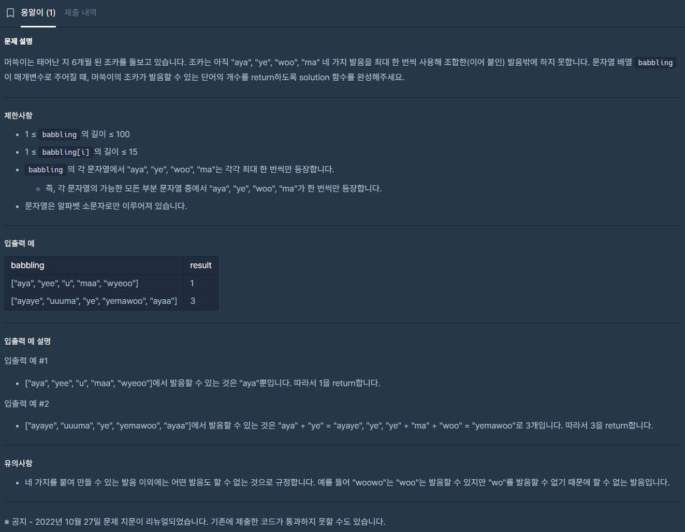

# 3/4

생성일: 2026년 3월 4일 오전 10:19

## 오늘 알고리즘 강의 정리

### 강의 범위

- 이번 회차 목표: BFS/DFS까지 확실히 이해하고 구현
- 이번 회차 제외: 백트래킹, 동적계획법, 다익스트라, 벨만-포드

### 느낀점

- 라이브러리/메서드 활용 능력이 부족하다고 느꼈고, 이 부분을 중점 보완하기로 함
- 문제 풀이 속도보다, 자료구조 선택과 표준 메서드 사용 숙련도를 먼저 높이기로 함

## 코딩테스트 문제 복기: 옹알이(aya, ye, woo, ma)

문제: 각 발음을 최대 1번씩만 사용해 단어를 만들 수 있을 때, 발음 가능한 단어 개수를 구하는 문제



### 부족했던 점

- string 메서드(compare) 시그니처 이해 부족으로 초기 구현에서 호출 방식이 틀렸음
- for/while의 위치 설계 미흡: match 실패 판정 위치가 잘못되어 조기 실패가 발생했음
- range-based for 이해가 부족했음

### 

정답 코드(기본형)

```cpp
int solution(vector<string> babbling) {
    int answer = 0;
    vector<string> token = {"aya", "ye", "woo", "ma"};

    // range-based for: babbling의 각 단어를 복사 없이(const reference) 순회
    for (const string& word : babbling) {
        vector<bool> used(4, false); // 각 발음은 최대 1번만 사용
        int pos = 0;                 // 현재 읽는 위치(왼쪽부터 소비)
        bool ok = true;

        // while 사용 이유: 단어 길이 끝까지 pos를 전진시키며 확인
        // (시간복잡도는 단어 길이 L에 비례, 전체 O(N * L * 4))
        while (pos < (int)word.size()) {
            bool match = false;

            for (int j = 0; j < (int)token.size(); j++) {
                int len = (int)token[j].size();

                // compare(pos, len, token[j]) == 0 :
                // word의 pos부터 len글자가 token[j]와 같으면 매칭
                if (!used[j] &&
                    pos + len <= (int)word.size() &&
                    word.compare(pos, len, token[j]) == 0) {
                    used[j] = true;
                    pos += len;      // 매칭된 길이만큼 이동
                    match = true;
                    break;
                }
            }

            // 토큰 전체를 다 확인한 뒤에도 매칭이 없을 때만 실패
            if (!match) {
                ok = false;
                break;
            }
        }

        // 카운트 증가 시점: '단어 하나' 검증이 끝난 뒤에만 증가
        if (ok && pos == (int)word.size()) {
            answer++;
        }
    }

    return answer;
}
```

### 복습 코드(유효 단어 목록 + count 출력)

```cpp
int solution(vector<string> babbling) {
    int answer = 0;
    int count = 0;
    vector<string> validWords;
    vector<string> token = {"aya", "ye", "woo", "ma"};

    for (const string& word: babbling) {
        vector<bool> used(4,false);
        int pos = 0;
        bool ok = true;

        while (pos < (int)word.size()) {
            bool match = false;
            for (int j = 0; j < (int)token.size(); j++) {
                int len = (int)token[j].size();
                if (!used[j] &&
                    pos + len <= (int)word.size() &&
                    word.compare(pos, len, token[j]) == 0) {
                    used[j] = true;
                    pos += len;
                    match = true;
                    break;
                }
            }
            if (!match) {
                ok = false;
                break;
            }
        }

        if (ok && pos == (int)word.size()) {
            answer++;
            count++;
            validWords.push_back(word);
        }
    }

    for (int i = 0; i < (int)validWords.size(); i++) {
        cout << validWords[i] << endl;
    }
    cout << count << endl;

    return answer;
}

int main() {
    vector<string> test = {"yewoo", "wooye", "mayeaya", "ayawooma", "woowoo", "aya"};
    cout << solution(test) << endl;
    return 0;
}
```

### 오늘 학습 포인트 요약

- 핵심 로직: pos 포인터로 문자열을 끝까지 소비하면서 토큰 매칭
- 중복 방지: used 배열로 각 발음 1회 제한 적용
- 복잡도: O(N * L * 4) 수준으로 제한 내 충분히 안정적
- [ ]  compare/substring 계열 메서드 시그니처 10분 복습