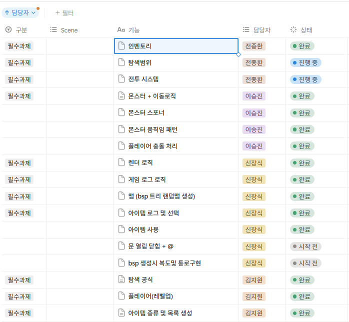
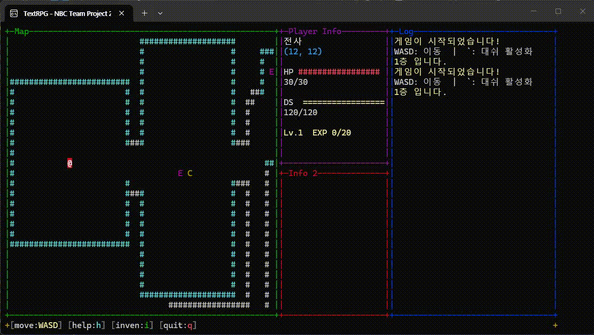

# 11조 [던전노조 발표 자료] 3/25~ 4/1

생성일: 2026년 4월 1일 오전 10:14

### 소개

팀장 - 신장식, 팀원 - 김지원, 팀원- 이승진, 팀원- 전종환



# 기획서

- 던전노조(가제) 게임 기획서
    
    # 📌 프로젝트 개요
    
    | 항목 | 내용 |
    | --- | --- |
    | 장르 | 로그라이크 턴제 던전 탐험 RPG |
    | 배경 | 중세 판타지 |
    | 플랫폼 | PC (콘솔/터미널 기반) |
    | 맵 규모 | 100 × 100 타일 |
    
    ## 레퍼런스 게임
    
    Shattered Pixel Dungeon
    
    
    
    ## 📒 문서 모음
    
    spreadsheets:
    [https://docs.google.com/spreadsheets/d/1cM5d1gMhKLpuqJOGj-DiciZgW4YiUPYYDTq7VYwd27o/edit?usp=sharing](https://docs.google.com/spreadsheets/d/1cM5d1gMhKLpuqJOGj-DiciZgW4YiUPYYDTq7VYwd27o/edit?usp=sharing)
    
    [플로우차트.excalidraw (1)](https://www.notion.so/excalidraw-1-335f77b24d2f80d494ace395e0971d21?pvs=21)
    
    ---
    
    # 🎮 핵심 게임플레이
    
    ## 게임 목표
    
    - 마지막 층에 도착해서, 보스 쓰러뜨리기
    
    ## 이동 시스템
    
    - 이동 방식 : **상·하·좌·우 단 1칸씩 이동** (대각선 이동 없음)
    - 입력 방법 : 키보드 방향키 또는 W, A , S, D
    - 이동은 **턴 기반** — 플레이어가 1칸 이동하면 몬스터도 1회 행동
    - 대쉬하여 이동시 한칸더 이동
    
    ## 전투 시스템
    
    1. 몬스터와 인접(접점) 시 전투 발생
    2. 전투 옵션 : `공격` / `아이템 사용` / `이동(도망)`
    3. 명중률 : 무기별로 상이 (아래 무기 표 참고)
    
    ## 회복 & 보상
    
    - 몬스터 처치 시 아이템 드롭
    - 아이템 사용시 체력 회복
    - 레벨업 이벤트로 체력 회복 가능 (선택 사항)
    
    ---
    
    # 📈 레벨 시스템
    
    ## 레벨업 보너스 (매 레벨)
    
    레벨업마다 아래 4가지 중 **1가지 선택**:
    
    - ❤️ 최대 체력 증가 + 3
    - ⚔️ 공격력 증가 + 1
    - 🛡️ 방어력 증가 + 1
    - 💨 민첩 증가 + 1
    - 💊 현재 체력 회복 + 5
    
    ## 레벨업 요구 경험치
    
    LV.1 ~ LV.15
    
    ---
    
    20
    
    ---
    
    # 🏗️ 맵 시스템
    
    ## 타일 범례
    
    | 기호 | 풀 네임 | 의미 | 10이내면 생성 X |
    | --- | --- | --- | --- |
    | `#` | ~~Wall~~ | 벽 (통과 불가) |  |
    | `@` | ~~Player~~ | 플레이어 위치 | X |
    | `R` | Rock | 바위 (좁은 장애물) |  |
    | `W` | Water | 물 (넓은 장애물) |  |
    | `M` | Monster | 몬스터 |  |
    | `>` | ~~Stair~~ | 계단 (다음 층) | X |
    | `C` | Chest | 보물 상자 |  |
    | `E` | Elite Monster | 엘리트 몬스터 |  |
    |  | Blank | 그 외 빈공간은 모두 투명 처리 | 여기서만 생성 |
    
    ## 맵 구성
    
    - 전체 맵 크기 : 1**00 × 100 타일**
    - 각 층은 **방 탐색 구조** — 방마다 구조물(벽), 몬스터, 아이템 배치
    - 다음층 계단(`>`) 생성 로직 : 룸 List 마지막방에 생성
    
    ---
    
    # 🔄 게임 플로우차트
    
    
    

[https://drive.google.com/file/d/1l0a_tAmKJ3JVNhTSTlvVcLZJA4u_7FsF/view?usp=sharing](https://drive.google.com/file/d/1l0a_tAmKJ3JVNhTSTlvVcLZJA4u_7FsF/view?usp=sharing)

# 핵심 기능 요약

| 시스템 | 파일 | 핵심 역할 |
| --- | --- | --- |
| **GameManager** | `GameManager/GameManager.h·cpp` | 게임 루프, 입력→행동→렌더 총괄 |
| **InputManager** | `GameManager/InputManager.h·cpp` | 키 입력 추상화 (GameAction) |
| **BspManager** | `BspManager/BspManager.h·cpp` | BSP 알고리즘 맵 자동 생성 |
| **ItemManager** | `Item/ItemManager.h·cpp` | 아이템 생성 팩토리 + 인벤토리 UI |
| **Render** | `Render/Render.h·cpp` | 콘솔 렌더링 시스템 전체 |
| **SpwanManager** | `SpawnManager/SpawnManger.h.cpp` | 스폰 관련 시스템 |

---

# 🕹️ 게임 루프 및 인풋 시스템

## **핵심 멤버 구조**


## **게임 루프 흐름**


📸 **[게임 실행 화면 전체]**


---

**[키 바인딩 표]**

| 키 | 행동 |
| --- | --- |
| W / S / A / D 및 방향키 | 이동 (상/하/좌/우) |
| 1 | 공격 (전투 중) |
| 2 | 도망 (전투 중) |
| ` (백틱) | 대쉬 활성화 |
| i | 인벤토리 열기/닫기 |
| Space | 아이템 사용 |
| h | 도움말 |
| q | 종료 |

**[타일 타입]**

| 타일 | 문자 | 설명 |
| --- | --- | --- |
| Player | `@` | 플레이어 위치 |
| Floor |  `` | 빈 공간 (이동 가능) |
| Wall | `#` | 벽 (이동 불가) |
| Stair | `>` | 계단 (다음 층) |
| Chest | `C` | 보물 상자 |
| Monster | `M` | 일반 몬스터 |
| EliteMonster | `E` | 엘리트 몬스터 |
| Boss | `B` | 보스 |

---

# 🌲 맵 자동 생성 시스템 (BSP 알고리즘)

## BSP 알고리즘 원리

BSP(Binary Space Partitioning)는 공간을 재귀적으로 **두 영역으로 계속 분할**하는 알고리즘입니다.

```
[전체 맵 공간]
        │
   ┌────┴────┐          ← 좌/우 (또는 상/하) 랜덤 분할
   │         │
 ┌─┴─┐     ┌─┴─┐        ← 다시 분할
 │   │     │   │
[방] [방] [방] [방]     ← 더 이상 분할 불가 → 각 영역에 방 하나씩 생성
```

1. **분할** — 공간이 최소 크기보다 크면 랜덤 방향(가로/세로)으로 절반씩 분할
2. **방 생성** — 더 이상 분할할 수 없는 말단 영역(leaf)마다 랜덤 크기의 방 조각
3. **복도 연결** — 트리를 거슬러 올라가며 형제 노드의 방 중심을 Z자형 복도로 연결
4. **복도 확장** — 1칸 너비 복도를 4방향 팽창시켜 3칸 너비로 확장
5. **방 타입 배정** — 첫 방 = Start, 마지막 방 = Stair, 나머지는 랜덤으로 Elite/Treasure/Normal 배정

## BSP 생성 파이프라인

```
Generate(map, params)
  │
  ├─ 1. map.Fill(Wall)          ← 전체 Wall로 초기화
  ├─ 2. BuildTree()             ← 파티션 재귀 분할 (BSP 트리 생성)
  ├─ 3. CarveRooms()            ← leaf 노드마다 랜덤 크기 방을 Floor로 조각
  ├─ 4. BuildRoomSnapshot()     ← 방 타일 스냅샷 저장 (복도/방 구분용)
  ├─ 5. ConnectTree()           ← Z자형 복도 중심선(1칸) 연결
  ├─ 6. DilateCorridor()        ← 복도를 4방향 팽창 → 3칸 너비로 확장
  ├─ 7. MarkDebugRoomWalls()    ← 방 경계 벽 색상 구분용 마킹
  └─ 8. AssignRoomTypes()       ← 방 타입 랜덤 배정
```

## 복도 구현 로직 상세

**1단계 — HCorridor / VCorridor (복도 중심선 그리기)**

```cpp
// 수평 복도: 지정한 행(row)에서 startCol ~ endCol 구간을 Floor으로 채움
void HCorridor(Map& map, int startCol, int endCol, int row)
{
    for (int col = min(startCol,endCol); col <= max(startCol,endCol); ++col)
        map.SetTile(col, row, Tile::Floor);
}

// 수직 복도: 지정한 열(col)에서 startRow ~ endRow 구간을 Floor으로 채움
void VCorridor(Map& map, int col, int startRow, int endRow)
{
    for (int row = min(startRow,endRow); row <= max(startRow,endRow); ++row)
        map.SetTile(col, row, Tile::Floor);
}
```

**2단계 — ConnectTree (Z자형 복도 연결)**

모든 연결은 **H복도 → V복도 → H복도** (Z자형) 또는 반대 순서로 연결됩니다.

```
[수직 분할: 좌||우]

  좌방 중심  spine열  우방 중심
      *──────── |           ← H복도
                |
                |───────*  ← V복도 → H복도

[수평 분할: 상=하]

  위방 중심
      *
      |             ← V복도
      |────────*  ← H복도
                |
                *   ← V복도
  아래방 중심
```

**3단계 — DilateCorridor (1칸 → 3칸 확장)**

```
 [확장 전]     [확장 후]

  # # # #      # # # #
  #   # #      #     #
  # # # #  →   #     #
  # # # #      #     #
  # # # #      # # # #

  중심선 1칸    주도 3칸
```

- 복도 중심선(Floor이면서 방이 아닌 타일)을 먼저 탐지
- 해당 타일의 4방향 좌표를 **물리 먼저 수집** 후 일괄 Floor 변환

📸 **[BSP 맵 생성 결과 화면]**



---

# 🖥️ 렌더 시스템

## 레이아웃 구현

---

# 🖼️ UI 및 그래픽

기본적인 배경 UI


ex) 예시 이미지


ex) 예시 이미지


```
┌────────────────────────┬──────────┬────────────────┐
│                        │  Player  │                │
│          Map           │   Info   │      Log       │
│      (뷰포트 기반)      │──────────│   (게임 로그)  │
│                        │  Info 2  │                │
├────────────────────────┴──────────┴────────────────┤
│  [help:h]  [inven:i]  [move:WASD]  [quit:q]        │
└────────────────────────────────────────────────────┘
```

📸 **[전체 UI 레이아웃 화면]**


📸 **[RenderInfo HP바]**


---

# 🎒 아이템 시스템


## **아이템 구현 목록**

| 코드 | 이름 | 효과 | 사용 가능 상황 |
| --- | --- | --- | --- |
| 101 | 회복 물약 | 체력 10 회복 | 전투 / 비전투 |
| 102 | 랜덤 이동 물약 | 맵 내 랜덤 Floor로 순간이동 | 비전투 중 |
| 103 | 투명화 아이템 | 5턴 동안 몬스터 탐지 회피 | 비전투 중 |
| 105 | 부활 토큰 | 사망 시 최대체력 50%로 자동 부활 | 전투 / 비전투 |

📸 **[인벤토리 UI 화면]**


📸 **[아이템 획득 → 인벤토리 → 사용 흐름 캡처 삽입]**


---

# 🏭 스폰 시스템

| 이름 | 스폰 위치 |
| --- | --- |
| 플레이어 | 첫번째 방 |
| 계단 | 마지막 방 |
| 상자 | 랜덤 |
| 몬스터 | 첫번째 방과 마지막을 제외한 방 |
| 엘리트 몬스터 | 엘리트방, 상자방 |
| 보스 | 마지막 스테이지 |

```cpp
class SpawnManager
{
private:
    SpawnManager();
    SpawnManager(const SpawnManager&) = delete;
    SpawnManager& operator=(const SpawnManager&) = delete;

    std::vector<Monster*> activeMonsters;
    int stage;

public:
    static SpawnManager* GetInstance()
    {
        static SpawnManager instance;
        return &instance;
    }
    ~SpawnManager();

    const std::vector<Monster*>& GetActiveMonsters() const; // 저장 및 조회
    void SpawnMonstersInRooms(Map& _map, const std::vector<Room>& _rooms, int _stage);
    void UpdateCleanup(Map& _map);
    void SpawnPlayerInRooms(Map& _map, const std::vector<Room>& _roomList, Player* player);
    void SpawnObjectInRooms(Map& _map, const std::vector<Room>& _roomList);
    Monster* GetMonsterAt(int targetX, int targetY);

		// 스테이지 별 등장 몬스터 구성이 다름
    void Stage1(Map& _map, const std::vector<Room>& _rooms);
    void Stage2(Map& _map, const std::vector<Room>& _rooms);
    void Stage3(Map& _map, const std::vector<Room>& _rooms);
    void Stage4(Map& _map, const std::vector<Room>& _rooms);
};
```

📸 **[스폰 결과 화면]**


---

# 👾 몬스터 시스템

## 몬스터 종류

| **스탯** | **고블린** | **오크** | **미믹** | **골렘** |  |
| --- | --- | --- | --- | --- | --- |
| 최대 체력 | 10 | 15 | 20 | 50 |  |
| 공격력 | 3 | 5 | 7 | 9 |  |
| 방어력 | 0 | 4 | 7 | 10 |  |
| 민첩 | 3 | 3 | 5 | 5 |  |
| 경험치 | 5 | 5 | 7 | 7 |  |
|  |  |  | (상자로 위장) |  |  |
|  | **엘리트_고블린** | **엘리트_오크** | **엘리트_미믹** | **엘리트_골렘** | **강철_골렘 (보스)** |
| 최대 체력 | 15 | 22 | 30 | 60 | 200 |
| 공격력 | 5 | 8 | 10 | 13 | 20 |
| 방어력 | 0 | 6 | 10 | 14 | 20 |
| 민첩 | 4 | 4 | 7 | 7 | 10 |
| 경험치 | 8 | 8 | 10 | 10 | 100 |

## 몬스터 랜덤 이동

플레이어가 1턴을 사용하면 각 몬스터들도 1턴을 받아 이동합니다.

```cpp
void Monster::Move(int _dx, int _dy, Map& _map)
{
    int nextX = x + _dx;
    int nextY = y + _dy;

    // 현재 위치와 다음 위치가 모두 유효해야 동작
    if (_map.InBounds(nextX, nextY) && _map.GetTile(nextX, nextY) == Tile::Floor)
    {
        // 이전 위치 타일 정리
        _map.SetTile(x, y, Tile::Floor);

        x = nextX;
        y = nextY;

        // 자신의 상태(Elite 여부)에 맞는 타일 배치
        if (isElite)
            _map.SetTile(x, y, Tile::EliteMonster);
        else
            _map.SetTile(x, y, Tile::Monster);
    }
}

void Monster::UpdateAI(Map& _map)
{
    // IDLE 상태일 때만 랜덤 이동
    if (state != MonsterState::IDLE) return;

    // 30% 확률로 이동
    if (rand() % 100 > 30) return;

    int direction = rand() % 4;
    int dx = 0, dy = 0;

    switch (direction)
    {
    case 0: dy = -1; break; // 위
    case 1: dy = 1;  break; // 아래
    case 2: dx = -1; break; // 왼쪽
    case 3: dx = 1;  break; // 오른쪽
    }

    if (_map.GetTile(x + dx, y + dy) == Tile::Floor)
        this->Move(dx, dy, _map);
}
```

📸 **[랜덤 이동 화면]**

