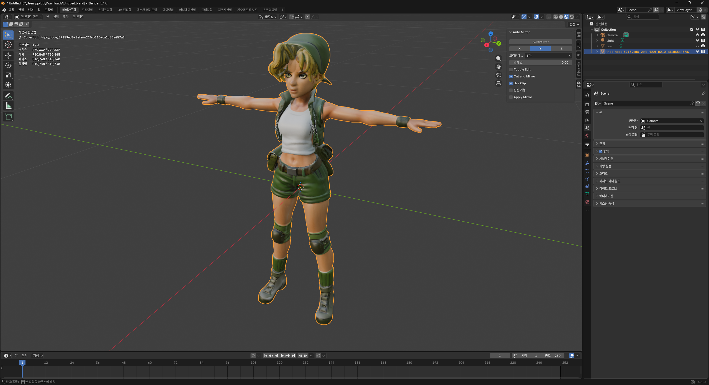
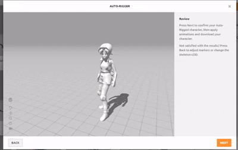
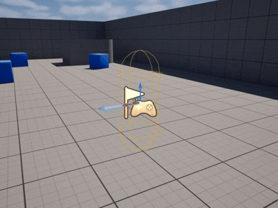

# 04/12 - TA 3dAI 사용및 애니메이션 적용

생성일: 2026년 4월 13일 오전 2:55

# 과제 목표

> **핵심:** AI 기반으로 캐릭터를 만들고, 실제 엔진에 적용해보는 경험
> 

> 3ds Max나 Blender로 직접 모델링하는 과제가 아님
> 
1. 3D AI 모델링 사이트를 활용하여 캐릭터 생성 (가능하면 리메쉬 / 리토폴로지까지)
2. Mixamo의 Auto Rigging 기능을 활용하여 애니메이션 적용
3. Unreal Engine에 캐릭터를 직접 임포트하여 확인

---

# 1단계 — 3D AI 모델링 (Tripo3D 사용)

## 진행 내용

- **Tripo3D** 에서 메탈슬러그 ERI 캐릭터 생성
- 유료 모델과 무료 모델 2종 비교 생성 후 무료로 추출가능한 모델 선택

트리포 3d AI 사용

유료 모델

무료 모델 1

무료 모델 2

로우폴리 버전 선택

## 시행착오

**문제 1 — Blender 조작이슈**

- 원인: 뷰포트가 **Solid 모드** 상태였음
- 해결: 뷰포트 우상단 반반 구체 아이콘(Material Preview 모드)으로 변경

**문제 2 — FBX 내보내기 시 머티리얼 소실 (UV 적용 실패)**

- 원인: AI 생성 모델이 UV 텍스처가 아닌 **버텍스 컬러(Vertex Color)** 방식으로 색을 표현
- FBX 포맷은 버텍스 컬러를 제대로 전달하지 못함
- 해결 시도: **Cycles 베이크**로 버텍스 컬러를 텍스처 이미지로 변환 시도
- **결과: UV 적용 최종 실패** — 베이크 후에도 머티리얼 소실 문제가 해결되지 않아 UV를 끝내 적용하지 못함

UV 적용 시도 — 버텍스 컬러로 인해 베이크 필요

베이크 후에도 머티리얼이 소실되는 모습

**문제 3 — 베이크 결과가 검게 나옴 (Circular Dependency)**

- 로그에 `Circular dependency for image` 에러 발생
- 이 에러로 인해 UV 텍스처 베이크가 실패, **결국 UV 적용을 완료하지 못함**

쉐이더 쪽에서도 적용해본모습 하지만 내보내기하면 빠짐

## 리토폴로지

- 로우폴리 모델은 확인했으나 **적용 가능한 리토폴로지 방법을 찾지 못함**
- Tripo3D의 리메쉬 기능은 유료 전용이었고, Blender에서 직접 적용하는 방법도 파악하지 못해 **최종적으로 리토폴로지를 적용하지 못함**

---

# 2단계 — Mixamo Auto Rigging

## 진행 내용

- Blender에서 FBX 추출 후 **Mixamo**에 업로드
- Auto Rigging 기능으로 자동 본(Bone) 배치 완료
- 애니메이션 적용된 모습 확인

FBX 추출 후 Mixamo에 업로드한 모습

오토 리깅 적용된 모습 (본 자동 배치 + 애니메이션)

---

# 3단계 — Unreal Engine 임포트

## 진행 내용

- Mixamo에서 리깅 및 애니메이션이 적용된 FBX 파일을 Unreal Engine으로 임포트
- 임포트 후 Skeletal Mesh와 본(Bone) 배치가 정상적으로 확인됨
- Mixamo에서 카포에라(Capoeira) 애니메이션을 다운로드하여 캐릭터에 적용 완료

Unreal Engine에 FBX 임포트 완료

Unreal Engine에서 오토 리깅 적용 — Skeletal Mesh 및 본(Bone) 자동 배치 확인

Mixamo에서 카포에라(Capoeira) 애니메이션 다운로드 후 캐릭터에 적용

애니메이션이 적용된 모습