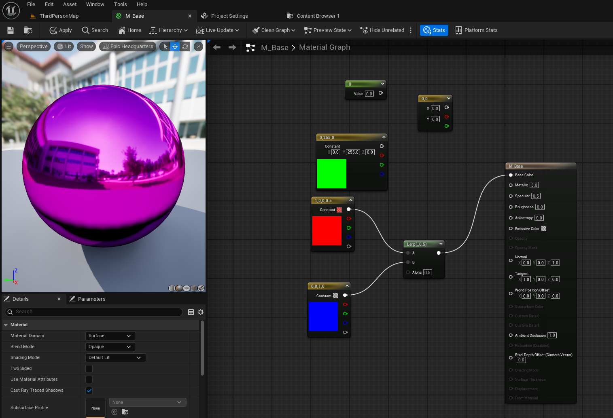

# 4/13 - TA 수업 & 백준

생성일: 2026년 4월 13일 오전 11:54

[https://3924js.github.io/posts/Tool-3DAI/](https://3924js.github.io/posts/Tool-3DAI/)

수업 발표 하신내용



텍스코디네이트


과제 투사체 만들기 ex)


---

# 백준 1157 — map 접근 & int 배열로 참고

<aside>

## 문제

알파벳 대소문자로 이루어진 단어에서 가장 많이 사용된 알파벳을 대문자로 출력.

단, 대소문자 구분 없이 집계. 동률이면 `?` 출력.

---

## map 접근 방식 — range-for로 순회

```cpp
map<char, int> m;
for (char c : str)
{
    if (c >= 'a' && c <= 'z')  // 소문자이면 대문자로 변환
        c = c - 'a' + 'A';     // ASCII 차이(32) 이용
    m[c]++;
}

int maxVal = 0;
char maxChar = '?';
bool dup = false;

for (auto& [key, val] : m)  // int 인덱스 대신 key/value 직접 순회
{
    if (val > maxVal)        { maxVal = val; maxChar = key; dup = false; }
    else if (val == maxVal)  { dup = true; }
}

cout << (dup ? '?' : maxChar) << "\n";
```

---

## 더 효율적인 방법 — int[26] 배열

`map` 대신 알파벳 26개 크기의 배열 사용.

```cpp
int cnt[26] = {};               // A~Z 인덱스 0~25
for (char c : str)
    cnt[toupper(c) - 'A']++;    // 'A'=0, 'B'=1, ..., 'Z'=25

int maxVal = 0, maxIdx = -1;
bool dup = false;
for (int i = 0; i < 26; i++)
{
    if (cnt[i] > maxVal)        { maxVal = cnt[i]; maxIdx = i; dup = false; }
    else if (cnt[i] == maxVal)  { dup = true; }
}

cout << (dup ? "?" : string(1, 'A' + maxIdx)) << "\n";
```

|  | map 버전 | int[26] 버전 |
| --- | --- | --- |
| 접근 속도 | O(log n) | O(1) |
| 메모리 | 동적 할당 | 고정 104 bytes |
| 순회 방법 | range-for (key/value 쌍) | index for |

# toupper()

<aside>
📌

`#include <cctype>` 필요. 소문자 → 대문자 변환, 나머지는 그대로 반환.

```cpp
toupper('a')  // 'A'
toupper('Z')  // 'Z'  (이미 대문자 → 그대로)
toupper('3')  // '3'  (숫자 → 그대로)
```

---

## if문 방식과 비교

```cpp
// if문 — ASCII 차이(32) 직접 이용
if (c >= 'a' && c <= 'z')  c = c - 'a' + 'A';

// toupper — 동일한 동작, 더 간결
c = toupper(c);
```

`'a'`(97) - `'A'`(65) = **32** 차이를 이용한 것

반대는 `tolower(c)`

</aside>

</aside>

# 심화반 테스트 문제 (2) 풀이 복기

# 1번 — 팰린드롬 판별

<aside>
📌

## 문제 요약

문자열 `s`가 팰린드롬이면 `1`, 아니면 `0` 반환

---

## 풀이 핵심

- 투 포인터: `left`(앞)와 `right`(뒤)를 좁혀가며 비교
- 다를 경우 즉시 `0` 반환, 끝까지 같으면 `1` 반환
- 빈 문자열 → `0`, 길이 1 → `1` 예외처리

```cpp
int solution(const string& s) {
    if (s.empty()) return 0;
    if (s.size() == 1) return 1;

    int left = 0;
    int right = (int)s.size() - 1;

    while (left < right) {
        if (s[left] != s[right]) return 0;
        left++;
        right--;
    }
    return 1;
}
```

---

## 복기

- 시간복잡도: **O(n)** — 문자열 절반만 순회
- `s.size()`는 `unsigned`형이므로 `-1` 연산 시 `(int)` 캐스팅 주의
</aside>

# 2번 — 섬의 개수 세기 (BFS)

<aside>
📌

## 문제 요약

N×M 격자에서 상하좌우로 연결된 땅(1)의 덩어리 수 반환

---

## Queue를 사용한 이유

`queue`는 BFS(너비 우선 탐색) 구현에 사용.

BFS는 발견한 칸을 **FIFO(선입선출)** 순서로 처리하며 연결된 모든 땅을 탐색한다.

| 방법 | 자료구조 | 특징 |
| --- | --- | --- |
| BFS | `queue` | 가까운 칸부터 탐색, 반복문으로 구현 |
| DFS (재귀) | 호출 스택 | 깊은 곳 먼저 탐색, 스택 오버플로우 위험 |

→ `queue`(힙 메모리)를 쓰면 격자가 매우 커도 **스택 오버플로우 없이 안전**

---

## 복기

- 방문 표시: `grid[r][c] = 0`으로 덮어써서 중복 카운트 방지
- 시간복잡도: **O(N × M)**
</aside>

# 3번 — 반사 벡터 계산 (논술)

<aside>
📌

## 문제 요약

입사 벡터 D(총알 진행 방향)와 법선 벡터 N(벽면 수직)이 주어질 때, 반사 벡터 R을 구하시오.

내적(dot product)을 반드시 활용할 것.

---

## 반사 벡터 공식 유도

반사는 **법선 방향 성분을 뒤집는** 것이다.

1. D를 법선(N) 방향 성분과 접선 방향 성분으로 분해
2. 법선 방향 성분 = (D·N)N
3. 접선 방향 성분 = D - (D·N)N
4. 반사 = 접선 성분은 유지, 법선 성분은 반전

→ **R = D - 2(D·N)N**

---

## 코드 구현

```cpp
struct Vector3 {
    float x, y, z;

    float dot(const Vector3& o) const {
        return x*o.x + y*o.y + z*o.z;
    }
    Vector3 operator-(const Vector3& o) const { return {x-o.x, y-o.y, z-o.z}; }
    Vector3 operator*(float t)           const { return {x*t,   y*t,   z*t};   }
};

// D: 입사 벡터, N: 법선 단위 벡터
// R = D - 2*(D·N)*N
Vector3 reflect(const Vector3& D, const Vector3& N) {
    return D - N * (2.0f * D.dot(N));
}
```

---

## 복기

- **D·N** = 내적 → 입사 벡터의 법선 방향 성분 크기 추출
- N은 반드시 **단위 벡터(크기=1)** 이어야 공식 성립
- 언리얼: `FVector::MirrorByVector()` 내부가 이 공식 그대로 구현됨
</aside>

# 4번 — virtual 소멸자 (정답: 2번)

<aside>
📌

## 문제 코드

```cpp
class Base {
public:
    ~Base() {}  // virtual 없음!
};
class Derived : public Base {
public:
    int* data;
    Derived() { data = new int[100]; }
    ~Derived() { delete[] data; }
};

Base* obj = new Derived();
delete obj;
```

---

## 정답: 2️⃣ Derived의 소멸자가 호출되지 않아 메모리 누수 발생

`Base::~Base()`에 `virtual`이 없으면 `delete obj` 시 **컴파일 타임 타입(`Base*`) 기준**으로 소멸자를 결정.

→ `Derived::~Derived()` 미호출 → `data` 메모리 해제 안 됨 → **메모리 누수**

---

## 해결

```cpp
virtual ~Base() {}  // virtual 추가 → 런타임에 Derived::~Derived() 호출
```

---

## 복기

상속 구조에서 기반 클래스 소멸자는 **항상 `virtual`** 로 선언

</aside>

# 5번 — volatile과 멀티스레드 (정답: 2번)

<aside>
📌

## 정답: 2️⃣ volatile은 컴파일러 최적화를 막지만, CPU 명령어 재정렬(reordering)은 막지 못한다

---

## volatile이 하는 것 vs 못 하는 것

|  | volatile | std::atomic |
| --- | --- | --- |
| 컴파일러 레지스터 캐싱 방지 | ✅ | ✅ |
| CPU 명령어 재정렬 방지 | ❌ | ✅ |
| 원자적(atomic) 접근 보장 | ❌ | ✅ |
| 멀티스레드 안전 | ❌ | ✅ |

`volatile` = **"항상 메모리에서 읽어라"** 만 보장. 멀티스레드 안전성은 `std::atomic` 또는 `mutex` 사용.

---

## 복기

- `volatile` ≠ thread-safe
- 멀티스레드 공유 변수에는 `std::atomic<T>` 또는 `mutex` 사용
</aside>

# 6번 — 캐시 지역성 (정답: 1번)

<aside>
📌

## 정답: 1️⃣ A — C++은 행 우선(row-major) 저장 방식이라 A가 연속된 메모리를 순서대로 접근한다

---

## 이유

C++ 2D 배열은 **행 우선(row-major)** 으로 메모리에 저장됨:

```
arr[0][0] arr[0][1] arr[0][2] | arr[1][0] arr[1][1] ...
←────── 연속된 메모리 ──────────────────────────────→
```

| 코드 | 접근 패턴 | 결과 |
| --- | --- | --- |
| A: `arr[i][j]` (i 고정, j 증가) | 연속 메모리 순서 접근 | 캐시 히트 ✅ |
| B: `arr[i][j]` (j 고정, i 증가) | 행을 건너뛰며 접근 | 캐시 미스 ❌ |

---

## 복기

- 캐시 라인(보통 64바이트)에 인접한 데이터가 미리 로드됨
- 열 방향 접근(B)은 매번 캐시 라인 교체 → 성능 저하
</aside>

# 7번 — 피보나치 시간복잡도 (정답: 4번)

<aside>
📌

## 정답: 4️⃣ O(2ⁿ)

---

## 이유

```cpp
int fib(int n) {
    if (n <= 1) return n;
    return fib(n-1) + fib(n-2);  // 매 호출마다 2개로 분기
}
```

`fib(n)` 호출 시 `fib(n-1)`, `fib(n-2)` **두 갈래로 분기** → n번 반복 → 호출 횟수 ≈ **2ⁿ**

```
fib(4)
├── fib(3)
│   ├── fib(2) → fib(1) + fib(0)
│   └── fib(1)
└── fib(2)
    ├── fib(1)
    └── fib(0)
```

---

## 최적화

| 방법 | 시간복잡도 | 공간복잡도 |
| --- | --- | --- |
| 순수 재귀 | O(2ⁿ) | O(n) 스택 |
| 메모이제이션 (Top-Down DP) | O(n) | O(n) |
| 반복문 (Bottom-Up DP) | O(n) | O(1) |

---

## 복기

- 재귀 호출이 **2개로 분기**되면 시간복잡도는 지수적으로 증가
- 실무/코테에서 피보나치는 반드시 **DP** 로 풀 것
</aside>

# 8번 — 스마트 포인터와 순환 참조

<aside>
📌

## 문제 코드

```cpp
struct Node {
    shared_ptr<Node> next;
    shared_ptr<Node> prev;
};
auto a = make_shared<Node>();  // ref count = 1
auto b = make_shared<Node>();  // ref count = 1
a->next = b;  // b ref count = 2
b->prev = a;  // a ref count = 2
```

---

## 발생하는 문제

`a`, `b` 스택 변수가 소멸되면 각 ref count가 2 → 1로 줄지만,

서로가 서로를 `shared_ptr`로 참조하고 있어 **영원히 0이 되지 않음** → 메모리 누수

---

## 해결: weak_ptr 사용

`weak_ptr`은 참조 카운트를 **증가시키지 않는** 약한 참조.

```cpp
struct Node {
    shared_ptr<Node> next;  // 강한 참조 (앞방향)
    weak_ptr<Node>   prev;  // 약한 참조 (뒤방향) ← 변경
};
```

|  | shared_ptr | weak_ptr |
| --- | --- | --- |
| 참조 카운트 증가 | ✅ | ❌ |
| 객체 수명 연장 | ✅ | ❌ |
| 순환 참조 유발 | 가능 | 해결책 |

---

## 복기

양방향 연결(이중 연결 리스트, 부모↔자식)에서는 **한쪽을 반드시 `weak_ptr`** 로 사용

</aside>

# 9번 — 데이터 지향 설계 (DOD)

<aside>
📌

## 문제 요약

수천 개의 Enemy를 **매 프레임 위치만 업데이트**하는 상황에서 AoS vs SoA 중 캐시 효율이 높은 설계와 이유 설명

---

## 정답: 설계 B (SoA) 가 유리

```cpp
// 설계 A: AoS (Array of Structures)
struct Enemy { FVector pos; float hp; float speed; };
TArray<Enemy> enemies;
// 메모리: [pos|hp|speed][pos|hp|speed][pos|hp|speed]...

// 설계 B: SoA (Structure of Arrays)
struct EnemyData {
    TArray<FVector> positions;  // [pos][pos][pos]...
    TArray<float>   hps;        // [hp][hp][hp]...
    TArray<float>   speeds;     // [speed][speed][speed]...
};
```

---

## 이유: 메모리 레이아웃 & 캐시 라인

|  | AoS (설계 A) | SoA (설계 B) |
| --- | --- | --- |
| 메모리 레이아웃 | pos·hp·speed 번갈아 저장 | pos끼리, hp끼리, speed끼리 연속 저장 |
| 위치만 업데이트 시 | hp·speed도 캐시에 함께 로드 → 낭비 | positions만 연속 접근 → 캐시 효율 ✅ |
| 캐시 히트율 | 낮음 | 높음 |

**AoS**: 캐시 라인(64bytes)에 pos+hp+speed 섞여 로드 → 쓰지 않는 hp, speed가 자리 차지

**SoA**: 캐시 라인 전체가 pos 데이터로 채워짐 → 한 번 로드로 더 많은 적의 위치 처리 가능

---

## 복기

- 특정 필드만 반복 접근할 때는 **SoA가 캐시 효율 우세**
- 언리얼 Mass Entity / ECS 아키텍처가 SoA 기반으로 설계된 이유
- 모든 필드를 동시에 쓰는 경우엔 AoS도 나쁘지 않음 (상황에 따라 다름)
</aside>