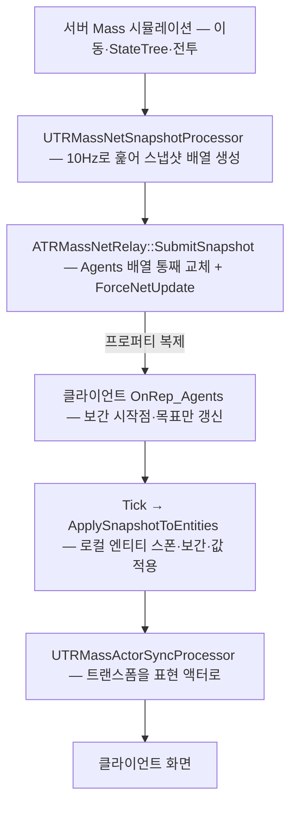

팀 프로젝트(TR)는 적을 액터가 아니라 Mass 엔티티로 굴린다. 한 판에 동시 120마리까지 나오는데, 이 방식에는 언리얼이 액터에게 주는 편의가 하나도 딸려 오지 않는다. 그중 제일 큰 것이 **복제**다. 서버가 아무리 정확하게 적을 움직여도, 접속한 클라이언트 화면에는 그 결과가 저절로 가지 않는다.

이 부분은 팀원이 구현했고 나는 전투·타게팅 프로세서를 맡았다. 내 코드는 서버에서만 도는데 그 결과가 남의 화면에 어떻게 도착하는지 모르면, "클라이언트에서만 안 되는" 문제가 났을 때 내 쪽을 볼지 복제 쪽을 볼지 판단할 수가 없다. 그래서 넷 복제 코드를 읽고 구조를 정리했다. 아래 사실과 수치는 전부 `TR/Source/TR` 의 `Mass/Net`·`Mass/Representation` 을 직접 읽어 확인한 것이다.

## 왜 기본 복제가 안 되는가

언리얼의 복제는 액터를 단위로 움직인다. Mass 엔티티는 액터가 아니라 프래그먼트 배열의 한 줄이라 `bReplicates` 를 켤 대상 자체가 없다.

막는 것이 하나 더 있다. 엔진이 Mass StateTree 를 서버 전용으로 박아 두었다 — 프로세서뿐 아니라 `UMassStateTreeTrait` 자체가 클라이언트에서 붙지 않는다. TR의 적은 자폭·사출·사격이 전부 StateTree 태스크에 들어 있다. 그래서 "서버가 웨이브 시드만 내려주고 클라이언트가 같은 시뮬레이션을 다시 돌린다"는 방식은 대역폭이 거의 0이라 매력적인데도 쓸 수가 없다. `TRMassNetRelay.h` 주석에 검토 기록이 남아 있다.

> 클라이언트 개체는 목표까지 걸어간 뒤 아무 일도 못 하고 영원히 쌓인다.

두 번째 이유도 같이 적혀 있다. 지형 스크롤과 지면 트레이스가 양쪽에서 미세하게 어긋나면 위치가 계속 벌어지고 그러면 플레이어가 조준하는 포탑과 화면이 안 맞는다.

## 고른 답 — 서버가 찍은 스냅샷을 내려보낸다

결론은 **클라이언트를 시뮬레이션이 아니라 순수 표현으로 두는 것**이다. 서버가 "무엇이 어디에 어떤 상태로 있는가"만 주기적으로 찍어서 보내고 클라이언트는 그걸로 화면만 만든다.

비용은 헤더 주석에 계산이 남아 있다 — 동시 상한이 120마리라 `120 × 12바이트 × 10Hz ≈ 14KB/s`. 이 수치는 코드 주석의 계산값이고 내가 패킷을 실측한 값은 아니다. `FVector_NetQuantize` 는 값에 따라 전송 바이트가 달라지므로 실제 평균은 다를 수 있다. 상한 120은 `TRWaveDirectorSubsystem.h` 의 `MaxConcurrent = 120` 이다.



## 한 마리를 무엇으로 눌러 담는가

적 한 마리의 복제 단위는 `FTRMassAgentSnapshot` 구조체 하나다. 표현에 필요한 최소한만 남기고 전부 잘라 냈다.

| 필드 | 타입 | 압축 근거(코드 주석) |
|---|---|---|
| `NetId` | `int32` | 서버가 스폰 시 부여. 클라이언트는 이 번호로 같은 적을 찾는다 |
| `Location` | `FVector_NetQuantize` | 1cm 단위. 표현용이라 밀리미터가 필요 없고 피해 판정은 서버가 자기 값으로 한다 |
| `Yaw` | `uint8` | `256/360` 배로 눌러 1바이트. 약 1.4도 해상도 |
| `ActionState` | `ETREnemyActionState`(uint8) | 클라이언트의 애니메이션 선택이 읽는 값 |
| `ConfigIndex` | `uint8` | 애셋 경로 대신 팔레트 색인만 보낸다 |
| `DamageRatio` | `uint8` | 0 = 멀쩡, 255 = 파괴 직전 |

두 가지가 눈에 띄었다.

**엔티티 핸들을 그대로 못 쓴다.** `FMassEntityHandle` 은 그 월드의 로컬 인덱스라 서버의 3번과 클라이언트의 3번이 다른 개체다. 그래서 서버가 별도 일련번호(`NetIdSerial`)를 매겨 `FTRMassNetIdFragment` 에 넣고 그 번호를 보낸다.

**체력이 아니라 손상 비율을 보낸다.** 클라이언트는 이 값으로 판정을 하지 않고 머티리얼에 넣을 0~1 하나만 필요하다. 비율로 보내면 티어마다 다른 최대 체력을 함께 실을 필요도 없어진다. 방향도 뒤집어 놨는데, 0이 "멀쩡"이어야 값을 못 받은 개체가 새 개체처럼 보이지 전원이 파괴 직전으로 보이지 않기 때문이다.

굽는 함수(`CollectFrom`)와 되돌리는 함수(`ApplyTo`)는 둘 다 이 구조체에 붙어 있다. 예전에는 필드 선언·값 수집·값 적용이 세 파일에 흩어져 있어서, 필드를 늘리고 한쪽을 빠뜨려도 컴파일이 되고 그 값만 클라이언트에서 조용히 기본값으로 남았다고 한다. 지금은 두 함수가 나란히 있어 한쪽을 고치면 다른 쪽이 눈에 들어온다.

## 언제 보내는가 — 스냅샷 프로세서

보내는 쪽은 `UTRMassNetSnapshotProcessor` 하나다. 매 프레임이 아니라 릴레이가 정한 주기로 보낸다. 매 프레임 보내면 대역폭이 프레임레이트에 끌려가는데, 표현용이라 그럴 이유가 없다.

- 주기는 릴레이의 `SnapshotInterval`(기본 `0.1`초 = 10Hz, `ClampMin 0.02`). 프로세서는 `NextSnapshotTime` 만 들고 있다가 시각이 되면 한 번 훑는다.
- 실행 그룹은 `UpdateWorldFromMass` — 시뮬레이션 결과를 월드 밖으로 내보내는 단계다. 릴레이 액터를 만지므로 `bRequiresGameThreadExecution = true` 다.
- 쿼리는 `FTransformFragment` 와 `FTRMassNetIdFragment` 가 필수, `FTREnemyStateFragment`·`FTREnemyVisualFragment` 는 `Optional`, `FTRChaserTag` 로 거른다. `NetId == 0` 인 개체(스폰과 같은 프레임에 잠깐 생긴다)는 건너뛴다.

### 여기서 제일 조심스러운 한 줄

넷 모드 플래그에 `Standalone` 이 왜 들어 있는지가 이 파일에서 제일 긴 주석이다.

```cpp
ExecutionFlags = (int32)EProcessorExecutionFlags::Server | (int32)EProcessorExecutionFlags::Standalone;
```

보낼 것이 있는 쪽은 서버뿐인데도 `Standalone` 을 빼면 안 된다. 이 플래그는 "지금 서버인가"가 아니라 **월드가 만들어질 때 무엇이었나**로 걸러지기 때문이다. 엔진은 처리 파이프라인을 월드 시작 시 한 번만 만들고 다시 만들지 않는다.

TR은 메인 메뉴에서 맵 이동 없이 방을 연다(`UTRGameInstance::StartListenInPlace` 가 `World->Listen()` 만 부른다). 그래서 호스트의 월드는 스탠드얼론으로 시작해 나중에 리슨 서버가 된다. `Server` 만 적으면 이 프로세서가 파이프라인에서 통째로 빠지고 스냅샷이 영원히 비어서 **클라이언트 화면에만 적이 안 나온다.** 에러도 경고도 없다 — 프로세서가 아예 안 도니 로그를 남길 주체가 없다. PIE 리슨 서버로도 재현되지 않는다. 그쪽은 월드가 처음부터 리슨 서버다.

그래서 실제로 보낼지 말지는 `Execute` 안에서 매 틱 넷 모드를 보고 정한다. 넷 모드는 매 틱 갱신되므로 방이 열리는 순간 다음 틱부터 저절로 살아난다.

```cpp
if (World->GetNetMode() == NM_Standalone)
{
    return;
}
```

## 어떻게 전달되는가 — 릴레이 액터

액터가 아닌 것을 복제하려니 액터 하나를 세워 그 위에 실었다. `ATRMassNetRelay` 는 `AInfo` 를 상속한 눈에 안 보이는 액터로, `bAlwaysRelevant = true` 라 모든 접속자에게 간다.

- `Agents`(`TArray<FTRMassAgentSnapshot>`)가 `ReplicatedUsing = OnRep_Agents`, 스폰에 쓰인 Config 목록인 `ConfigPalette` 가 `Replicated` 다.
- `SubmitSnapshot` 은 권한을 확인한 뒤 배열을 통째로 갈아끼우고 `ForceNetUpdate()` 를 부른다. 액터 자체는 `SetNetUpdateFrequency(30)`·`SetMinNetUpdateFrequency(10)` 으로 자주 나갈 수 있게 열어 두고 실제 주기는 위 프로세서가 잰다.
- 서버는 이 액터의 틱을 끈다(`SetActorTickEnabled(bIsClient)`). 서버는 스냅샷을 만들기만 하고 반영하지 않는다 — 자기 엔티티가 이미 진짜다.

## 클라이언트가 하는 일

받는 쪽은 스냅샷을 그대로 화면에 꽂지 않고 두 단계로 나눠 처리한다.

`OnRep_Agents` 는 보간의 시작점을 지금 위치로 옮기고 목표만 갱신한다. 실제 반영을 여기서 하지 않는 이유는 엔티티 생성이 프레임 스파이크를 만들기 때문이다.

반영은 `Tick` 의 `ApplySnapshotToEntities` 가 한다.

1. **처음 보는 `NetId` 면 로컬 표현 엔티티를 만든다.** `ConfigPalette[ConfigIndex]` 로 애셋을 풀고 `UMassSpawnerSubsystem::SpawnEntities` 로 하나 스폰한 뒤, 그 엔티티의 `FTRMassNetIdFragment` 에 번호를 적어 둔다.
2. **스냅샷 사이를 보간한다.** 진행도는 `InterpSpeed = 1 / SnapshotInterval` 로 감는다 — 주기보다 조금 빠르게 감아서 다음 스냅샷이 늦어도 목표에 도달해 있게 한다. 늦으면 멈춘 것처럼 보이는 편이 낫다는 판단이다.
3. **속도는 위치 차분으로 만든다.** 클라이언트에는 이동 프로세서가 없으니 `FMassVelocityFragment` 를 채울 곳이 여기밖에 없고 애니메이션이 대기와 이동을 이 값으로 가른다.
4. **보간이 필요 없는 값은 `ApplyTo` 가 옮긴다.** 행동 상태와 손상도가 여기 들어간다.
5. **스냅샷에서 사라진 `NetId` 는 지운다**(`DestroyMissingEntities`).

여기서 인자 하나에 주석이 길게 붙어 있다. `ApplyTo` 에 넘기는 시각은 **클라이언트의 월드 시각**이어야 한다. 두 월드는 시간 원점이 달라서 서버 시각을 넣으면 단발 애니메이션의 경과 시간과 피격 플래시가 엉뚱하게 계산된다.

그 뒤 트랜스폼을 실제 표현 액터에 밀어 넣는 것은 `UTRMassActorSyncProcessor` 다. 이 프로세서는 `AllNetModes` 라 서버와 클라이언트 양쪽에서 돈다. 표현 시스템은 액터를 스폰할 때 위치를 한 번 정해줄 뿐 이후 추적을 하지 않아서, 이게 없으면 액터가 스폰된 자리에 서 있고 엔티티만 움직인다.

## 조용히 틀리는 것을 막는 장치

이 구조에서 제일 위험한 실패는 크래시가 아니라 **아무 일도 안 일어나는 것**이다. 프래그먼트는 트레이트가 만들기 때문에 클라이언트에도 전부 존재한다. 다만 값을 채우는 프로세서가 서버 전용이면 그 값은 스폰 기본값에서 영원히 변하지 않는다. 컴파일된다. 쿼리도 매칭된다. 경고 한 줄 안 난다. 게다가 호스트에서 혼자 돌리면 재현되지 않는다 — 리슨 서버의 호스트는 서버라서 전부 정상이다.

그래서 `TRMassNetContract.h` 라는 파일이 따로 있다. 기능이 없고 규칙만 있는 헤더다. 어떤 Mass 상태가 클라이언트에도 존재하는지를 표로 못박아 두었다. 아래는 그중 일부다.

| 상태 | 클라이언트에서 | 근거 |
|---|---|---|
| `FTRMassNetIdFragment` | 복제됨 | 서버가 부여, 릴레이가 채운다 |
| `FTREnemyStateFragment` | 복제됨 | `ActionState` 가 스냅샷에 실린다 |
| `FTREnemyVisualFragment` | 복제됨 | `DamageRatio` 가 스냅샷에 실린다 |
| `FTREnemyCombatFragment` | **기본값 고정** | 체력을 깎는 곳이 전부 서버 전용 |
| `FTRTargetFragment` | **기본값 고정** | 조종·표적 프로세서가 `Server\|Standalone` |
| `FTRDeadTag` | **안 붙는다** | 전투 서브시스템·StateTree 둘 다 서버 |

표만 두면 아무도 안 읽으니 검사를 붙였다. 서버에서만 채워지는 값을 쿼리에 요구할 때는 `AddRequirement` 대신 `UE::TR::Mass::AddServerAuthoredRequirement` 를 쓴다. 하는 일은 `AddRequirement` 와 같다. **클라이언트에서도 도는 프로세서면 시작할 때 `ensureMsgf` 로 잡는 것**이 존재 이유다. 태그용(`AddServerAuthoredTagRequirement`)도 한 쌍으로 있다.

태그 쪽이 프래그먼트보다 더 조용히 실패한다. `Presence::All` 이면 클라이언트에서 아무것도 매칭되지 않아 프로세서가 통째로 놀고, `Presence::None` 이면 전부 통과해 필터가 없는 것과 같아진다. 그래서 계약의 세 번째 규칙은 **태그로 거르던 것을 클라이언트에서도 걸러야 하면 행동 상태로 바꾸라**는 것이다. 상태는 복제되고 태그는 안 된다. 덤으로 태그 부착이 명령 버퍼를 거치며 생기는 한 프레임 지연도 없어진다.

실제로 적용된 자리가 레이더다. `UTRMassRadarProcessor` 는 `AllNetModes` 라 클라이언트에서도 도는데, 시체를 레이더에서 빼는 판정을 `FTRDeadTag` 가 아니라 `ActionState == Death` 로 한다. 태그로 했다면 호스트에서는 시체가 즉시 사라지고 클라이언트 레이더에만 남는, 재현이 어려운 차이가 났을 자리다.

같은 결의 장치가 셋 더 있다.

- `Config/DefaultMass.ini` 가 표현·LOD 프로세서 셋(`MassLODCollectorProcessor`·`MassVisualizationLODProcessor`·`MassVisualizationProcessor`)에 `ExecutionFlags=7`(= `AllNetModes`)을 명시한다. 엔진 기본값이 `Server | Standalone` 이라 이걸 안 쓰면 접속한 클라이언트에서만 엔티티는 있는데 아무것도 안 그려진다.
- `VerifyClientRepresentationPipeline()` 이 클라이언트 `BeginPlay` 에서 그 셋이 실제로 도는지 확인하고 아니면 어느 ini 를 봐야 하는지까지 로그에 적는다.
- `LogClientDiagnostics()` 가 5초마다 `스냅샷 N / Config 팔레트 N / 로컬 엔티티 N` 을 남긴다. "클라에서만 적이 안 보인다"는 증상 하나로는 복제·애셋·표현 중 무엇이 문제인지 구분할 수 없는데, 이 세 숫자 중 어디서 0이 되는지가 원인을 가른다.

## 내가 맡은 코드와의 접점

읽은 목적이 여기였다. 내 전투·타게팅 프로세서는 전부 서버 권위로 돌고 그 결과가 클라이언트에 가는 통로는 위 스냅샷 하나뿐이다. 세 군데를 확인했다.

**하나. 내 프로세서들은 계약의 검사를 통과하도록 넷 모드가 좁혀져 있다.** `UTREnemyAttackProcessor` 와 `UTRTargetSyncProcessor` 는 둘 다 `Server | Standalone` 이다. 서버 전용 값을 요구하는 자리마다 `AddServerAuthoredRequirement` 계열을 쓴다 — 공격 쪽이 `FTREnemyCombatFragment`·`FTRDetonatingTag`(All)·`FTRDeadTag`(None) 세 건, 타게팅 쪽이 `FTRTargetFragment` 한 건이다. 이 넷 중 하나라도 클라이언트에서 도는 프로세서가 읽으면 시작할 때 `ensure` 가 뜬다.

**둘. 내가 깎은 체력이 남의 화면에 도착하는 경로는 1바이트짜리 손상도뿐이다.** `UTRMassCombatSubsystem::ApplyDamageToEntity` 가 `FTREnemyCombatFragment::Health` 를 줄이는데, 이 프래그먼트는 위 표의 "기본값 고정" 줄이다. 서버에서 `UTRMassEnemyVisualProcessor` 가 체력 비율을 뒤집어 `DamageRatio` 로 만들고 그 값만 스냅샷에 실린다. 그래서 내가 포탑 범위 공격용으로 추가한 `ApplyRadialDamage` 로 여러 마리를 한꺼번에 깎아도, 클라이언트가 보는 것은 각 개체의 손상 비율이 올라간 결과뿐이다. 피격 플래시조차 값이 **올라간 것만** 피격으로 보는 같은 규칙을 서버와 클라이언트가 각각 돌린다.

이 순서에도 조건이 하나 걸려 있다. 손상도를 계산하는 프로세서가 `ExecuteBefore` 로 스냅샷 프로세서와 액터 싱크 프로세서보다 앞에 오도록 못박혀 있다. 뒤로 밀리면 표현과 복제가 늘 한 프레임 늦은 손상도를 본다.

**셋. 죽음은 태그가 아니라 상태로 건너간다.** 내 쪽 사망 처리는 `FTRDeadTag` 를 붙이고 속도·조종력을 끊지만, 그 태그는 클라이언트에 가지 않는다. 클라이언트가 사망을 아는 유일한 근거는 같은 함수가 함께 부르는 `TryEnterActionState(*State, ETREnemyActionState::Death, ...)` 다. 사망 연출이든 레이더 필터든 클라이언트 쪽에서 뭔가를 걸러야 하면 태그가 아니라 이 상태를 봐야 한다는 뜻이다.

## 정리

분석해서 남은 것은 규칙 한 줄이다. **클라이언트에 무엇이 존재하는지는 프래그먼트가 있느냐가 아니라 그 값을 채우는 코드가 어디서 도느냐로 정해진다.** 프래그먼트는 양쪽에 다 있으므로 컴파일도 되고 쿼리도 잡히지만, 값을 넣는 쪽이 서버 전용이면 클라이언트가 읽는 것은 스폰 기본값이다. 이 실패에는 에러도 경고도 없고 호스트에서는 재현되지 않는다. 그래서 규칙을 사람의 기억이 아니라 `ensure` 와 ini 와 5초짜리 로그로 옮겨 놓은 것이 이 코드의 핵심이었다.

> **핵심 요약** — Mass 엔티티는 액터가 아니라 기본 복제가 없고 엔진이 StateTree 를 서버 전용으로 박아 둬서 클라이언트 재시뮬레이션도 못 쓴다. TR은 적 한 마리를 약 12바이트(코드 주석 기준)로 눌러(`FVector_NetQuantize` 위치 + Yaw·행동 상태·Config 색인·손상도 각 1바이트) 10Hz로 릴레이 액터의 복제 배열에 실어 보내고, 클라이언트는 그걸로 로컬 표현 엔티티를 만들어 보간만 한다. 프로세서 넷 모드에서 `Standalone` 을 빼면 방을 열기 전에 만들어진 파이프라인에서 통째로 빠지므로, 서버 전용 동작은 플래그가 아니라 `Execute` 안의 넷 모드 검사로 거른다. 클라이언트에서 무엇을 읽어도 되는지는 `TRMassNetContract.h` 의 표가 기준이다. 위반은 `AddServerAuthoredRequirement` 의 `ensure` 가 시작할 때 잡는다.
{: .prompt-tip }
