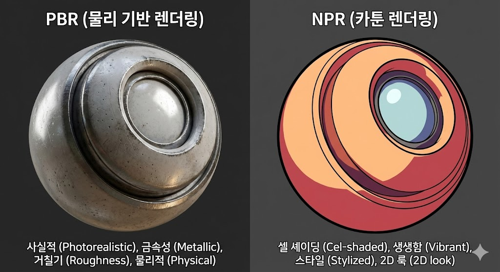
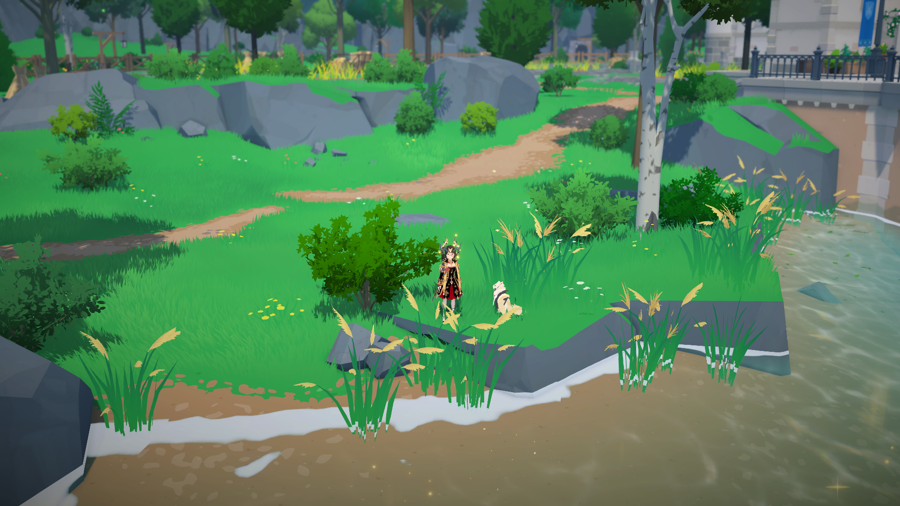
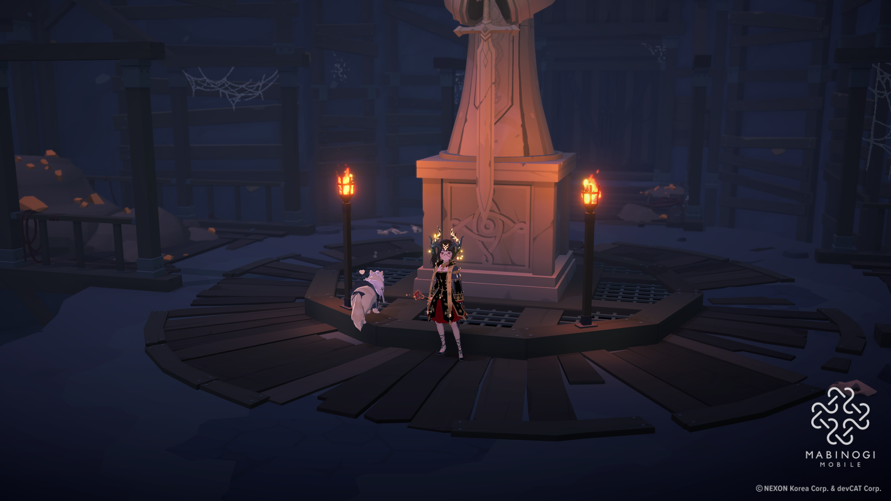
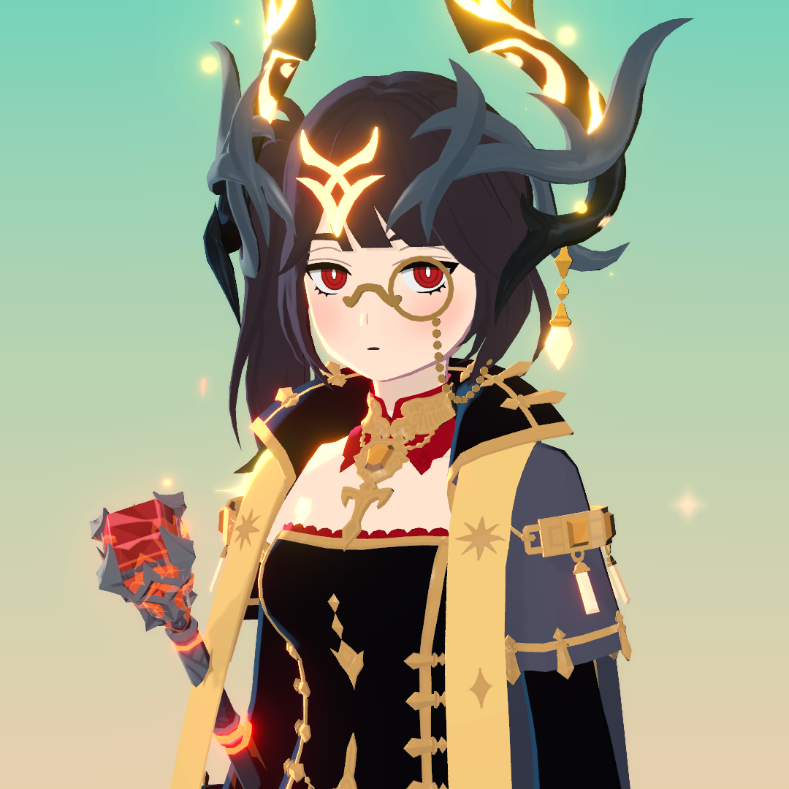
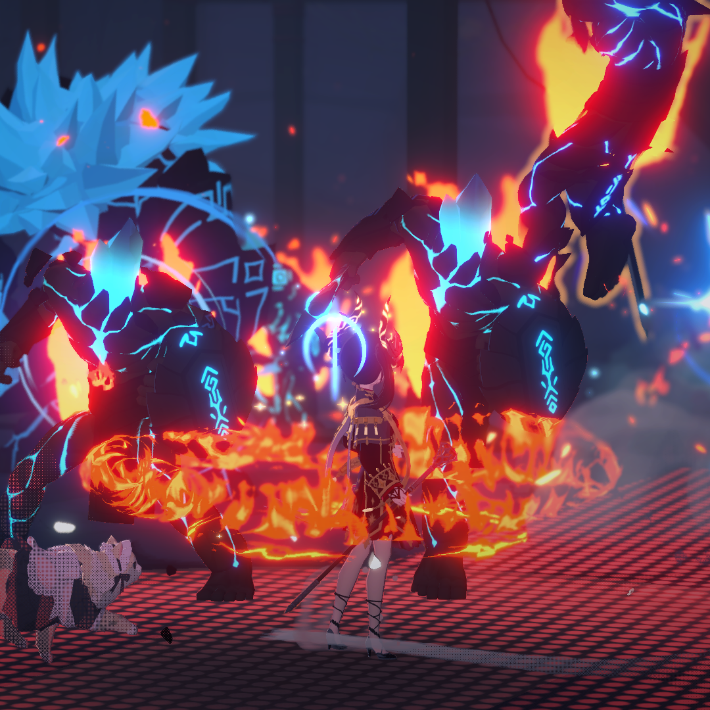
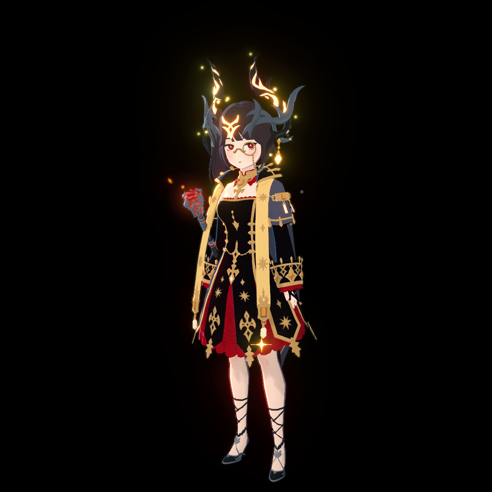
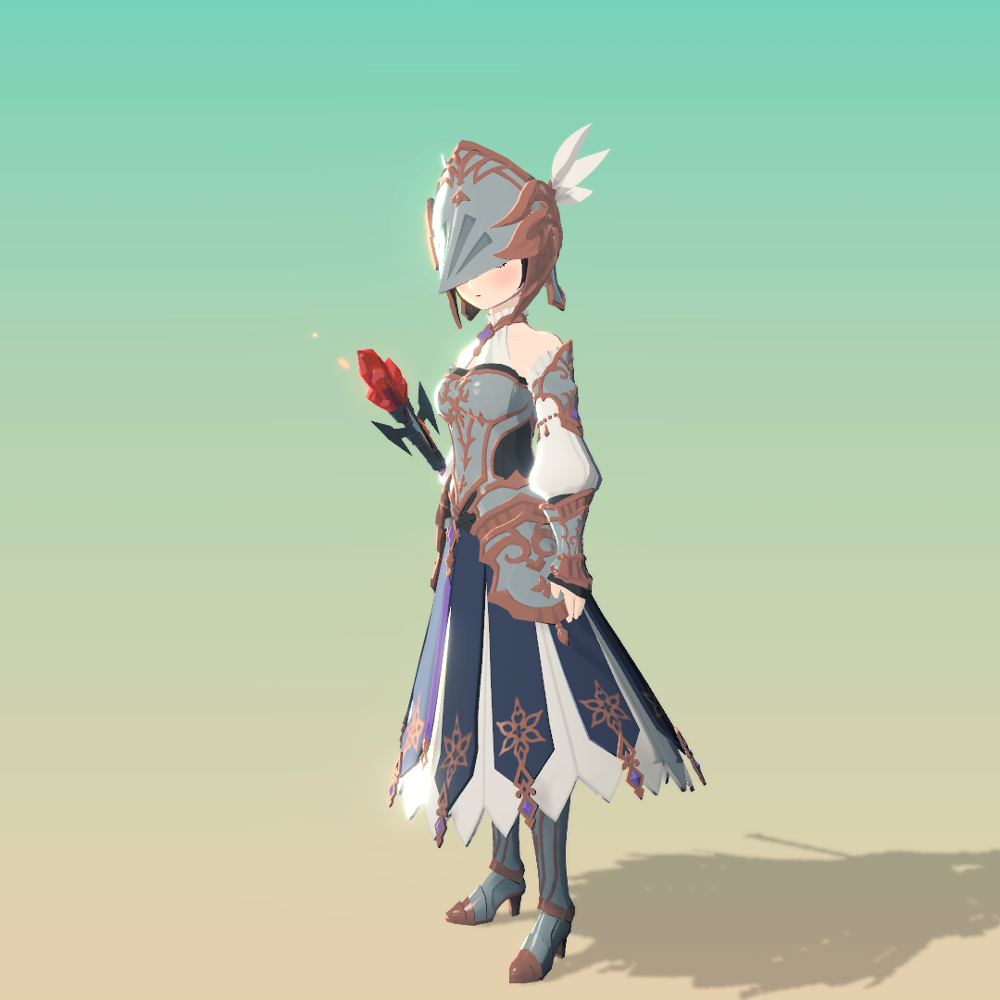

# 04/06 - 마비노기 모바일 툰쉐이딩 분석

생성일: 2026년 4월 6일 오후 12:32

<aside>

## TA(Technical Artist)

TA는 아트와 프로그래밍 사이에서, 원하는 비주얼이 실제 게임 엔진 안에서 구현되고 안정적으로 동작하도록 연결하는 역할을 맡는다. 일반적으로 셰이더, VFX, 렌더링 파이프라인, 최적화, 아티스트용 제작 환경 구성 등이 TA의 업무 범주에 포함된다.

이번 분석에서는 이러한 TA의 역할을 마비노기 모바일의 카툰 렌더링에 대입해 살펴본다. 즉, 셀 셰이딩의 명암 단계, 아웃라인 처리, 조명 영향 제어, 모바일 환경에서의 성능 대응 같은 요소들이 실제로 어떤 식의 기술적 설계와 파이프라인 판단 위에서 구현되었을지를 TA 관점에서 해석하는 데 목적이 있다.

| TA의 주요 업무 | 마비노기 모바일과의 연결 |
| --- | --- |
| 셰이더 작성 (HLSL / Material Editor) | 툰쉐이딩 셰이더 제작, 아웃라인·림라이트 구현 |
| VFX / 이펙트 제작 (Niagara, Cascade) | 피격 파티클, 히트 플래시, 스파크 이펙트 제작 |
| 렌더링 파이프라인 설계 | Deferred Shading 채택, AA 방식 선택, 후처리 설정 |
| 아트 애셋 최적화 | 모바일 환경에서 이펙트 폴리곤 수·텍스처 해상도 조정 |
| 아티스트 가이드라인 제작 | 아웃라인 두께, 셰이더 파라미터 규칙 문서화 |
</aside>

---

<aside>

## 툰쉐이딩(Toon Shading) 분석

툰쉐이딩은 **NPR(Non-Photorealistic Rendering)** 기법의 일종으로, 3D 오브젝트를 2D 애니메이션/만화처럼 보이게 렌더링하는 기술이다.

PBR이 현실의 빛을 물리적으로 시뮬레이션하는 것과 달리, 툰쉐이딩은 **단계화된 색상**과 **아웃라인**으로 만화적 느낌을 만들어낸다.

<aside>

**카툰 렌더링(Cartoon Rendering)의 구성**

카툰 렌더링은 아래 두 기법을 **한 세트**로 묶어 칭하는 개념이다.

- **셀 셰이딩 (Cel Shading)**: 폴리곤 면의 셰이딩 단계를 단순화시키는 기법 → 명암을 2~3단계로 끊어 처리
- **잉크라인 렌더링 (Ink-line Rendering)**: 모델의 외부 표면을 먹선(잉크 선)으로 감싸 처리하는 기법 → 외곽선 묘사

두 기법이 합쳐질 때 비로소 우리가 흔히 아는 "만화 같은" 렌더링이 완성된다.

</aside>

- NPR vs PBR 핵심 비교
    
    
    | 구분 | PBR | NPR / 툰쉐이딩 |
    | --- | --- | --- |
    | 목표 | 현실적 빛 시뮬레이션 | 만화/애니메이션 스타일 표현 |
    | 명암 표현 | 부드러운 그라데이션 | 2~3단계 계단식 명암 |
    | 아웃라인 | 없음 | 외곽선 필수 |
    | 반사광 | 물리적으로 정확한 반사 | 스타일화된 Specular |
    | TA 작업량 | 파라미터 기반 표준 셰이더 | 커스텀 셰이더 직접 제작 필요 |

---

### **① 색상 단계화 (Step / Cel Shading)**

빛의 강도에 따라 색을 부드럽게 변화시키는 대신, **여러 색상 밴드(Band)** 로 렌더링하여 만화·애니메이션의 음영 스타일을 모방하는 기법이다.

- **Lit (밝은 영역)**: 기본 Albedo 색상
- **Mid Tone**: 약간 어두운 그림자 색
- **Shadow (어두운 영역)**: 고정된 어두운 톤

> 셀 셰이딩 ≠ 아웃라인. Borderlands는 아웃라인은 있지만 셀 셰이딩은 아니다. 두 기법이 함께 쓰일 때 카툰 렌더링이 완성된다.
> 

---

**🔧 UE4 구현 방식 (Kodeco 튜토리얼 기반)**

핵심: 표면 법선과 빛 방향의 **내적값**을 임계값으로 끊어 색상 밴드를 만든다.

**① 조명 버퍼 계산** — SceneTexture로 DiffuseColor 분리 후 밝기 추출

조명 버퍼 계산 노드 구성

**② If 노드로 밴드 분리** — 임계값 0.5 기준으로 색상 단계 나누기

임계값 비교 노드 전체

**③ Post Process Volume + Before Tonemapping 설정**

Before Tonemapping 설정

**④ LUT로 밴드 개수·전환 효과 제어**

최종 노드 구성도

3단계 명암 결과

다양한 LUT 효과 비교

> **TA 관점**: 명암이 나뉘는 구간과 각 단계의 색조·명도 값을 셰이더 파라미터로 노출해, 아티스트가 코드 수정 없이 스타일을 조정할 수 있게 만드는 것이 TA의 역할이다.                                                                                                                                                                                                          이번 분석에서 확인했듯 어두운 던전과 밝은 야외 환경에서도 캐릭터 색상이 비교적 일관되게 유지된 것은, 조명 영향 특히 Ambient 성분을 셰이더 단계에서 제한하거나 보정한 설계 결과로 해석할 수 있다.                                                                                                                                                                                                                                                                                                      LUT : 텍스처나 머티리얼 파라미터 조정만으로 전체 셰이딩 인상을 바꿀 수 있도록 구성하는 것도 대표적인 TA 작업이다.
> 

<aside>

**주제관련 마비노기 모바일 분석**

캡처 설명: 게임 내 밝은 야외 / 어두운 던전에서 캐릭터 정지 후 스크린샷

확인 포인트: 명암이 몇 단계로 끊어지는지 / 배경 조명이 달라져도 캐릭터 색이 크게 안 바뀌는지

**분석 결과:**

- **[야외]** 강변 자연 배경에서 풀·바위·나무가 채도 높은 원색(초록·회색)으로 렌더링됨. BotW 스타일 느낌의 밝고 아기자기한 톤 확인.
- **[어두운 던전]** 횃불만 있는 어두운 환경에서도 캐릭터의 검은 드레스·붉은 장식이 고유 색상을 유지함 → Ambient 조명 영향 최소화(NPR 특성) 확인.
- **두 씬 비교:** PBR 게임이라면 어두운 씬에서 캐릭터 색이 크게 바뀌겠지만, 두 사진에서 캐릭터 색상 변화 폭이 작음 → 셀 셰이딩의 조명 저항성 입증.

</aside>

---

### **② 잉크라인 렌더링 (Ink-line Rendering / Outline Rendering)**

모델의 외부 표면을 **선(잉크 선)으로 감싸 처리**하는 기법. 셀 셰이딩과 함께 카툰 렌더링의 양대 축을 이룬다.

아웃라인이 없으면 셀 셰이딩만으로는 만화 특유의 "선화" 느낌이 나지 않는다. 두 기법이 합쳐져야 완전한 카툰 렌더링이 된다.

구현 방식은 크게 두 가지로 나뉜다.

**[기법 A] Back-face Culling 반전 (Inverted Hull)**

원본 메시를 복제해 검은색으로 만들고 약간 확대한 뒤, 법선을 반전시켜 실루엣을 만든다.

안쪽 면만 보이게 되어 원본 뒤로 검은 외곽이 남는 원리. 퍼포먼스 효율이 좋아 모바일에서 선호.

- 장점: 깔끔한 폴리곤 기반 외곽선 / 두께 조정 용이
- 단점: 메시 내부 디테일 미표현 / 급한 모서리에서 구멍 생길 수 있음

Inverted Hull 아웃라인 결과

**[기법 B] 후처리 엣지 감지 (Post-process Edge Detection)**

후처리 엣지 감지는 화면 렌더링이 끝난 뒤 **Depth/Normal 차이**를 이용해 경계선을 검출하는 방식이다.

씬 전체에 일괄 적용하기 쉽고 거리와 무관하게 선 두께를 일정하게 유지할 수 있지만, **픽셀 기반** 특성상 계단 현상과 노이즈가 두드러질 수 있어 AA 부담이 커진다.

- 장점: 거리에 상관없이 선 두께 일정 / 씬 전체 일괄 적용
- 단점: 노이즈에 취약 / 성능 고정 비용 발생

Post-process Edge Detection 결과

- 두 기법 비교
    
    
    | **항목** | **Inverted Hull** | **Post-process Edge Detection** | **마비노기 모바일** |
    | --- | --- | --- | --- |
    | 선의 질 | 폴리곤 기반, 캐릭터 실루엣이 안정적 | 픽셀 기반, 배경/이펙트에 노이즈 가능 | Inverted Hull 쪽에 가까움 |
    | 적용 범위 | 캐릭터/중요 메시 위주 선택 적용 | 씬 전체 자동 적용 | 캐릭터 중심 적용으로 보임 |
    | 성능 특성 | 메시 단위 비용 증가 | 화면 전체 고정 비용 | 모바일 특성상 Hull 계열이 유리 |

<aside>

**주제관련 마비노기 모바일 분석**

캡처 설명: 캐릭터 실루엣 가장자리 클로즈업 / 캐릭터와 몬스터 동시 화면

확인 포인트: 아웃라인 두께 균일성 / 끊김 없이 이어지는지 / 색상(검정/짙은 색)

**분석 결과:**

- **[클로즈업]** 머리카락·뿔·의상 경계선에 균일한 두께의 검은 아웃라인 확인. 뿔 실루엣, 옷깃, 어깨 라인에서 끊김 없이 이어지는 아웃라인 관찰됨.
- **[전투]** 캐릭터뿐 아니라 대형 몬스터에도 동일한 아웃라인 규칙 적용됨. 이펙트(불꽃·파란 글로우)가 일부를 덮지만, 몬스터 실루엣 경계에서 확인 가능.
- **[전신]** 가장 명확한 확인 포인트. 검은 드레스 가장자리·머리카락·부츠 모두에 일관된 두께의 검은 아웃라인이 전신에 적용됨.
- **기법 추정 근거:** 배경 오브젝트가 아닌 캐릭터·몬스터에 선택적으로 적용된 점이 후처리 Edge Detection보다 **Inverted Hull 방식**에 가까운 특성.

</aside>

- NPR 엣지 픽셀 비용
    - 일반 PBR 게임 엣지 픽셀 비중: **1~2%** *(추정값)*
    - NPR 기반 게임 엣지 픽셀 비중: **4~5%** (약 2~4배) *(추정값)*
    
    → TA는 이 추가 비용을 인지하고, 엔진의 AA 설정을 NPR에 맞게 최적화하는 역할을 한다.
    

> **TA 관점**: 어떤 기법을 선택할지는 TA가 결정한다. 모바일 타겟이라면 드로우콜과 GPU 부하를 고려해 Inverted Hull 방식이 현실적이고, Custom Depth Pass를 활용하는 방식도 고려할 수 있다(UE4부터 지원, UE5 전용 기능 아님). 이번 분석에서 캐릭터·몬스터 전체에 걸쳐 균일한 두께의 아웃라인이 확인된 것은, TA가 두께 파라미터를 기준화하고 아티스트에게 가이드라인으로 배포한 결과다.
> 

---

### **③ 림라이트 (Rim Light)**

캐릭터 실루엣 가장자리에 역광처럼 빛을 추가해 **캐릭터를 배경에서 분리**시키는 기법.

프레넬(Fresnel) 공식 기반으로, 시선 각도와 법선 방향의 차이가 클수록(= 가장자리일수록) 강하게 빛난다.

가장자리의 노란색이 림 라이트. 마스크의 하얀색 부분만 림라이트가 나오도록 조정한다

<aside>

**주제관련 마비노기 모바일 분석**

캡처 설명: 어두운 배경 앞 역광 구도에서 캐릭터 촬영

확인 포인트: 실루엣 가장자리 빛 발광 유무 / 색상(흰색·파란색 등) / 발광 강도

**분석 결과:**

- 황혼빛 야외 씬. 캐릭터가 배경 건물과 시각적으로 분리되어 보임 → 캐릭터 분리 효과 확인.
- 뿔 장식에 주황/금색 발광이 관찰됨.
- **뿔 발광 = 이미시브(Emissive) 이펙트:** 추가 제공된 중립 조명(방향광 없는 그라데이션 배경) 이미지에서도 뿔이 동일하게 금빛으로 발광하고 불꽃·반짝임 파티클이 동반됨. Fresnel 림라이트는 빛 방향·각도에 따라 변해야 하지만, 던전/야외/중립 배경 모든 환경에서 동일하게 발광 → 뿔 액세서리 자체에 Emissive 값이 설정된 것.
- **Fresnel 림라이트:** 완전 검은 배경 + 역광 구도 캡처에서 양쪽 다리 바깥 실루엣 가장자리에 **림라이트** 띠가 명확히 확인됨. 뿔의 Emissive와 달리 실루엣 엣지에만 발광하는 Fresnel 특성 → 몸통·다리·뿔 실루엣에 Fresnel 기반 림라이트 적용.

</aside>

> **TA 관점**: 림라이트 색상·강도·범위를 머티리얼 파라미터로 노출시켜 아티스트가 씬별로 조정할 수 있게 한다. 카툰 스타일에서는 림라이트 색을 단색으로 고정하거나 강하게 과장하는 것이 일반적이고 뿔처럼 캐릭터 아이덴티티를 강조하는 액세서리에 Emissive를 활용하는 것은 NPR에서 림라이트와 함께 자주 쓰이는 TA 설계 패턴. 조명 환경과 무관하게 캐릭터의 인상을 유지하는 효과.
> 

---

## 마비노기 모바일에서 툰쉐이딩을 이렇게 만든 이유

**① 셀 셰이딩: 플레이 캡처 기반 관찰**

마비노기 모바일 게임 캡처 분석으로 관찰된 셀 셰이딩 특성. 명암이 부드럽게 이어지지 않고 불연속적으로 끊어지는 구간이 확인됨:

- **밝은 영역** → 기본 색상 유지
- **중간 영역** → 단계적으로 어두워지는 구간
- **어두운 영역** → 고정된 어두운 톤 유지

야외·던전 등 조명 환경이 크게 다른 곳에서도 캐릭터 색상이 일관되게 유지됨이 컴포어 관찰됨 → Ambient 조명 영향을 억제한 NPR 특성으로 추정. 금속·천 소재 간 셰이딩 방식 차이도 동일 캐릭터에서 확인됨 → PBR+NPR 하이브리드 구조로 추정.

**② 아웃라인 렌더링: Inverted Hull 방식 채택**

모델을 두 번 렌더링하는 Inverted Hull 방식 사용 확인:

1. 원본 메시 정상 렌더링
2. 단색(어둡게) + 약간 확대한 복사본 덮어씌우기 → 두 렌더링의 차이가 아웃라인으로 표현됨
- 모바일의 드로우콜 제약 환경에서 퍼포먼스 효율이 좋아 선택
- 캐릭터·몬스터 모두 동일한 두께 규칙 적용, TA가 파라미터 기준 가이드라인화

> **참고 (이터니티 PC 리마스터 한정):** 마비노기 이터니티(PC 리마스터)에서는 원작 PC 셰이더를 리마스터에 이식하는 과정에서 SceneDepth 기반 후처리 아웃라인 방식도 추가 도입된 것으로 알려져 있음. 단, 이는 **모바일 버전과 별개의 개발 맥락**이며 모바일에 동일 방식이 적용됐다는 공식 근거는 미확인.
> 

**③ 아트 레퍼런스 & 색상 설계**

닌텐도 《야생의 숨결》(BotW)·《동물의 숲》을 벤치마킹한 원색 중심 팔레트 설계. 채도 높은 색상으로 밝고 아기자기한 분위기를 연출하며, PBR 하이엔드 게임과 직접 비교를 피하는 독자적 아트 아이덴티티 구축에 성공. 배경의 풀·나무 흔들림 같은 환경 상호작용 연출도 비주얼 완성도에 기여.

**④ 모바일 최적화 관점**

NPR 기법은 AA(안티에일리어싱) 처리가 까다롭다. 엣지 픽셀이 PBR 대비 2~4배 많아 AA 비용이 높기 때문에, 마비노기 모바일에서는 AA를 끄고 렌더링 스케일을 높이는 방식이 시각적·성능 면에서 모두 유리하다. TA가 NPR 파이프라인에 맞게 AA 전략을 조정한 대표적 사례.

<aside>

**마비노기 모바일 장비 소재 비교**

캡처 방법: 동일 캐릭터 금속 장비 부품 vs 천 부품

확인 포인트: 금속 부분에 PBR 하이라이트가 보이는지 / 카툰 명암과 PBR 반사가 공존하는지

**분석 결과:**

- **금속 부위(투구·어깨 갑옷):** 흰색/은색 금속 갑옷에 하이라이트(Specular) 반응 관찰 → PBR Metallic 소재 처리 확인.
- **천 부위(파란 스커트·치마):** NPR 방식의 플랫한 단계 명암으로 처리되어 금속 부위와 셰이딩 방식이 다름.
- **결론:** 같은 캐릭터에서 금속·천 소재의 셰이딩 방식이 다르게 처리됨 → **PBR + NPR 하이브리드 구조** 실증.
- TA 관점: 재질별로 다른 셰이더 파라미터(Metallic/Roughness vs NPR Threshold)를 동일 캐릭터에 혼합 적용하는 것이 TA의 셰이더 설계 역할.

</aside>

</aside>

---

# 회고

이번 분석을 하면서 가장 인상 깊었던 점은, 마비노기 모바일을 단순히 유저 시점이 아니라 TA 관점에서 바라볼 수 있었다는 점이다. 평소에는 자연스럽게 받아들였던 화면 표현들을 셀 셰이딩, 외곽선, 조명 반응 같은 요소로 나누어 분석해보면서, 하나의 비주얼이 만들어지기까지 다양한 기술적 요소가 함께 작동한다는 점을 다시 생각해보게 되었다.

또한 나는 개인적으로 카툰 렌더링 특유의 분위기와 표현 방식을 좋아해왔는데, 이번 작업을 통해 그 스타일이 실제 게임 안에서 어떤 식으로 구현되어 보이는지를 직접 분석해본 경험이 특히 의미 있게 남았다. 툰 쉐이딩(카툰 렌더링)이라는 기술을 알고는 있었지만, 화면에 드러나는 결과를 기준으로 구조를 나누어 보고 TA의 시선으로 해석해본 것은 처음이었다. 이를 통해 이런 표현을 구현하고 다듬는 과정이 TA의 역할과 깊게 연결되어 있다는 점을 조금 더 이해할 수 있었고, 마비노기 모바일이 카툰 렌더링을 어떤 방식으로 화면에 녹여내고 있는지 살펴본 점도 인상 깊었다.

---

<aside>
📚

## 참고 자료

**참고 링크**

- [UE4 Cel Shading Tutorial - Kodeco](https://www.kodeco.com/146-unreal-engine-4-cel-shading-tutorial)
- [UE4 Toon Outlines Tutorial - Kodeco](https://www.kodeco.com/92-unreal-engine-4-toon-outlines-tutorial)
- [Cel Shading - Wikipedia](https://en.wikipedia.org/wiki/Cel_shading)
- [Types of Shading Techniques in Animation, VFX - FilmDaft](https://filmdaft.com/types-of-shading-techniques-in-animation-video-games-vfx-with-examples/)
- [Stylized VFX in Unity - Step, Smoothstep, Dissolve](https://torchinsky.me/stylized-vfx-unity-01/)
- [The Directing of Stylized Game Effects to Increase Hit Impact (논문)](https://www.aodr.org/xml//39681/39681.pdf)
- [URP로 Toon Shader 만들기 -Rim Light 1-](https://wincnt-shim.tistory.com/354)
- [언리얼 엔진 직무 - 테크니컬 아티스트](https://www.unrealengine.com/ko/tech-blog/jobs-in-unreal-engine---technical-artist)
- [테크니컬 아티스트가 하는 4가지 일](https://gamefx.co.kr/bbs/board.php?bo_table=free_01&wr_id=424)
- [마비노기 모바일 그래픽 평가 - 나무위키](https://namu.wiki/w/%EB%A7%88%EB%B9%84%EB%85%B8%EA%B8%B0%20%EB%AA%A8%EB%B0%94%EC%9D%BC/%ED%8F%89%EA%B0%80)
- [마비노기 본가 쉐이더 이식](https://mabinogi.nexon.com/eternity/dev_view.asp?id=4891478)
- [유니티 NPR 렌더링](https://jeonguju.tistory.com/201)

</aside>