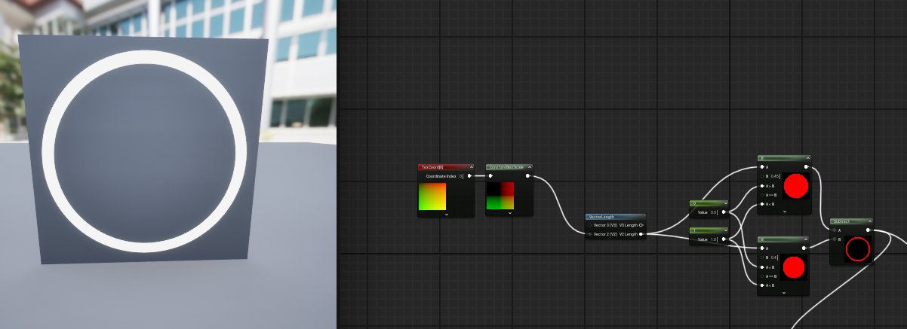
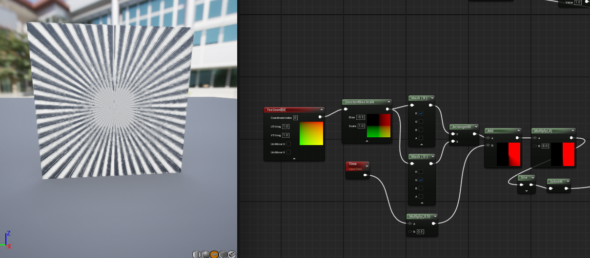
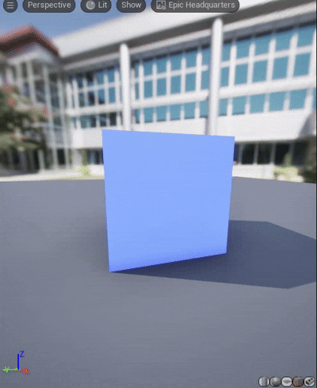
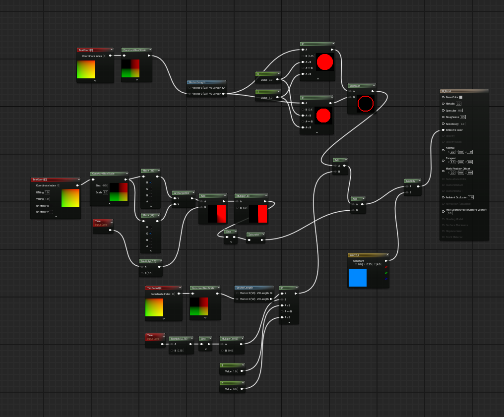
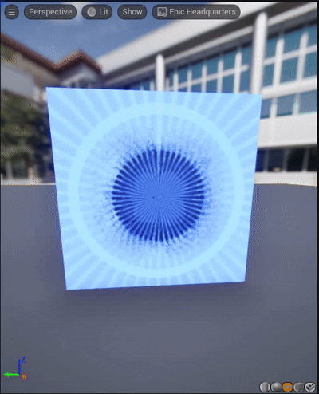

# TIL — 2026-04-19

## 이번 주 과제

**프로시듀얼 쉐이더 응용하기**

> 💡 Tip — 바운스 느낌 애니메이션을 만들려면 다음 노드를 활용:
> `TexCoord (UVTiling)` · `Time` · `Sine`

참고 링크: [프로시듀얼 쉐이더 가이드 (jurevstudio)](https://jurevstudio.tistory.com/entry/%ED%94%84%EB%A1%9C%EC%8B%9C%EB%93%80%EC%96%BC-%EC%89%90%EC%9D%B4%EB%8D%94)

---

## 1. 프로시듀얼 쉐이더를 공부하면서 느낀 것

튜토리얼을 따라가면서 "아 이건 텍스처를 그려서 붙이는 게 아니라 **매 픽셀마다 수식을 계산해서 색을 결정**하는 거구나" 하는 감각을 잡았다.
처음엔 `TexCoord` 가 왜 필요한지 잘 몰랐는데, 결국 **화면상의 위치를 수식의 입력값으로 쓰기 위한 좌표계**라는 걸 알고 나니 이후 노드들이 왜 필요한지 자연스럽게 이해됐다.

특히 인상적이었던 건:
- 이미지 파일 없이도 **중심에서의 거리(VectorLength)** 하나만으로 원을 그릴 수 있다는 점
- `Time` + `Sine` 을 적절히 곱하고 더하는 것만으로 **맥동/회전/바운스** 가 전부 만들어진다는 점
- 결국 쉐이더는 "어떤 수식을 어디에 꽂느냐" 의 싸움이라는 점

---

## 2. 바운스 애니메이션에서 헤맨 부분

처음엔 `Sine(Time)` 을 `Lerp.Alpha` 에 연결해서 **색만 빨강↔검정으로 바뀌고 크기는 안 바뀌는** 현상을 겪었다.
왜 안 되지 하고 한참 봤는데, 원인은 **크기를 결정하는 곳(=`If` 노드의 B 입력, 반지름)에는 Sine 을 안 꽂았기 때문**이었다.

**핵심 깨달음**: 애니메이션하고 싶은 값이 뭐냐에 따라 **Sine 출력을 꽂는 위치가 달라진다.**
색을 움직이려면 Lerp 알파에, 크기를 움직이려면 `If.B` 에, 위치를 움직이려면 `Subtract` 중심값에. 같은 Sine 이라도 어디 꽂느냐에 따라 결과가 완전히 달라진다.

---

## 3. 포탈 / 소환진 머티리얼 만들기

맥동 원 만드는 것까지 성공하고 나니 "이걸로 뭘 만들 수 있지?" 싶어서 **포탈/소환진 응용**에 도전했다.

구조는 3 레이어 합성:

```
┌─ Layer 1: 외곽 링 (도넛)
├─ Layer 2: 회전하는 룬 패턴
└─ Layer 3: 중앙 맥동 코어
           → 전부 Add 해서 색 입히고 Emissive 로
```

---

## 4. 실제 구현 기록 (레이어별)

### 🟢 Layer 1 — 외곽 링 (도넛)

**작업 순서**

1. `VectorLength` 출력을 **If 두 개**의 A 입력에 동시 연결
2. 하나는 B=0.45 (큰 원), 다른 하나는 B=0.40 (작은 원)
3. `Subtract` 노드에서 큰 원 - 작은 원 → 도넛 마스크 완성

**헤맨 점**

처음엔 `Subtract` 를 **두 개** 만들어서 각 If 결과에서 `1.0` 씩 빼려고 했다. 당연히 말도 안 되는 결과가 나왔고, 한참 헤매고 나서야 **"Subtract 하나로 두 If 출력을 A-B 에 각각 꽂아야 한다"** 는 걸 깨달음.
"하나의 Value 노드 출력이 여러 If 에 동시에 연결될 수 있다" 는 것도 이때 알게 됨. 노드는 **한 출력 → 여러 입력 fan-out 이 자유롭다**.

**스크린샷**



---

### 🟡 Layer 2 — 회전하는 룬 패턴

**작업 순서**

1. 처음엔 `Rotator` + `Texture Sample` 로 가려다 **룬 텍스처가 없어서** 절차적 방식으로 전환
2. `ConstantBiasScale(-0.5)` 로 UV 를 -0.5~0.5 범위로 변환 (중심이 0,0 이 되도록)
3. `ComponentMask` 로 X/Y 를 분리해서 `Atan2` 에 넣어 **각도** 계산
4. 각도에 `Time` 을 더하면 회전, `Multiply(8)` → `Sine` 하면 **8갈래 룬 패턴**

**헤맨 점**

- `Texture Sample` 에 텍스처를 안 넣었더니 미리보기가 **시커멓게** 나와서 "왜 안 되지" 하고 꽤 오래 붙잡음. 결국 이미지 에셋이 필요하다는 걸 깨닫고 절차적으로 갈아탐.
- **X, Y 컴포넌트를 어떻게 분리하지?** 가 큰 장벽이었다. 처음엔 TexCoord 오른쪽 클릭에서 찾으려 했는데 없었고, 별도 노드인 **`ComponentMask`** (R/G/B/A 체크박스로 원하는 채널만 뽑는 노드) 를 써야 한다는 걸 검색으로 알게 됨.
- `Atan2` 입력 순서를 반대로 꽂아서 방향이 거꾸로 돌아가는 해프닝도 있었음. **수학 그대로 `atan2(Y, X)`** 순서.

**스크린샷**



---

### 🔴 Layer 3 — 중앙 맥동 코어

**작업 순서**

1. 처음 만든 **맥동 원** 을 그대로 재사용
2. 반지름을 링 안쪽(0.40) 보다 작게 (`0.10 ~ 0.20` 맥동) 조정해서 링 안에 얌전히 들어가도록

**헤맨 점**

이 단계가 바로 앞에서 말한 **"Sine 을 Lerp 에 꽂아서 색만 바뀌는" 실수**가 있었던 곳. 결과적으로 맥동을 **크기(반지름)** 에 꽂는 법을 배우게 된 원인이 됐다.

**스크린샷**




---

### 🎨 최종 합성

**작업 순서**

1. 세 레이어 출력을 `Add` 노드 두 개로 합침 (Add 는 입력이 2개뿐이라 3레이어 → Add 2번 필요)
2. 합친 마스크에 `Multiply` 로 색(Constant3Vector, HDR 값) 을 곱해 `EmissiveColor` 로 보냄
3. Blend Mode 는 `Translucent`, Shading Model 은 `Unlit` 로 설정해 **항상 밝게** 빛나도록

**머티리얼 설정**

| 항목 | 값 |
|---|---|
| Material Domain | Surface |
| Blend Mode | Translucent |
| Shading Model | Unlit |
| Two Sided | ✅ |

**헤맨 점**

- 막상 블로그에있는데로는했는데 뭘만들어야될지 모르겠어서 이것저것만저보긴 했는데 조잡한느낌이 많이들어서 아쉽습니다.

**스크린샷**




---

## 5. 오늘 배운 것 정리

- **쉐이더는 결국 수식이다.** 어떤 수식을 어떤 입력(UV / 거리 / 각도 / 시간) 에 꽂는지가 전부.
- **같은 Sine(Time) 이라도 꽂는 위치에 따라 색/크기/위치/회전이 바뀐다.** 애니메이션을 원하는 "값" 이 뭔지를 먼저 정하고 거기로 연결해야 함.
- **머티리얼 노드는 한 출력 → 여러 입력 fan-out 이 자유롭다.** Value 노드를 재사용하거나 VectorLength 를 여러 If 에 나눠주는 식.
- **Add / Subtract / Multiply 는 모두 이항 연산** 이라 3개 이상 합성할 땐 노드를 여러 번 거쳐야 한다.
- **텍스처 없이도 Atan2 + Sine 으로 방사형 무늬**를 만들 수 있다는 건 생각보다 강력했다. 앞으로 이펙트 만들 때 절차적 패턴을 먼저 고려해보게 될 듯.
- **HDR 색상 (>1.0 RGB) + Bloom** 이 발광 이펙트의 체감 품질을 결정한다. 색상 값을 "그림물감처럼 0~1 안에서만" 생각하면 안 된다.
